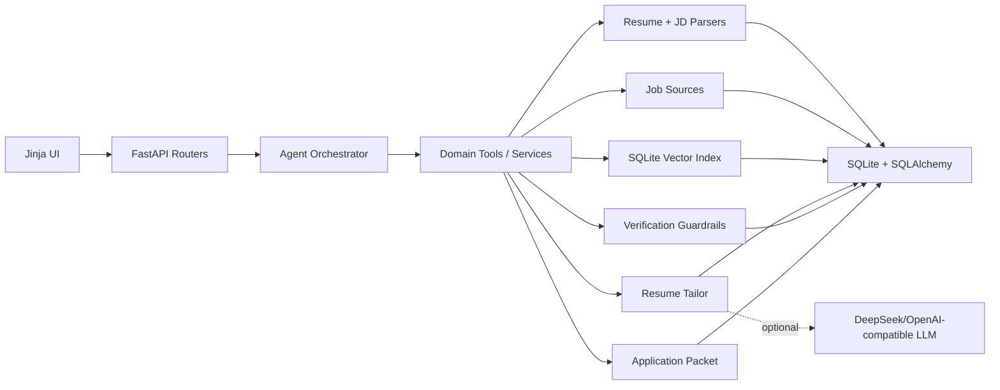

# CareerAgent

CareerAgent is a production-shaped job-search agent for internship candidates who want to apply for Agent / LLM application roles. It turns a resume PDF or guided answers into a structured profile, searches real company career sources, ranks jobs, tailors a resume with SQLite-backed RAG evidence, verifies hallucination risk, and prepares a trackable application packet.

The project is designed as a resume project for Agent engineering roles: the default demo domain is Agent development internships, but the workflow is generic enough for other technical jobs.

## What It Does

- Parse resume PDFs with `pypdf`, then normalize into a structured candidate profile.
- Generate a profile from guided Q&A when no resume is ready.
- Split resume evidence into PDF/raw-text and structured chunks.
- Store chunks and deterministic hash embeddings in SQLite for offline RAG retrieval.
- Search real career sources:
  - Tencent Careers public job API.
  - Lever public postings API for configurable company slugs.
- Parse JD text into required skills, responsibilities, qualifications, and keywords.
- Rank jobs against a profile with explainable dimension scores.
- Tailor a resume to a JD using retrieved evidence and an optional OpenAI-compatible LLM endpoint.
- Run rule-based guardrails to flag unsupported metrics and possible fabricated claims.
- Generate a quick-apply packet with cover letter, outreach message, checklist, apply URL, and tracking status.
- Record Agent runs, steps, artifacts, latency, and outputs for observability.

## Architecture



## Quick Start

```bash
python -m venv .venv
.\.venv\Scripts\activate
pip install -r requirements.txt
copy .env.example .env
uvicorn app.main:app --reload
```

Open:

- UI: http://localhost:8000
- API docs: http://localhost:8000/docs
- Health: http://localhost:8000/health

## LLM Configuration

The app runs without an LLM using deterministic parsers and resume tailoring fallbacks. To enable DeepSeek-compatible generation, fill `.env` locally:

```env
LLM_API_KEY=your_key_here
LLM_BASE_URL=https://llmapi.paratera.com
LLM_MODEL=DeepSeek-V4-Pro
```

Never commit `.env` or real API keys.

## Main Workflows

1. Create a profile:
   - Upload a PDF at `/ui/profiles`.
   - Or create one from guided answers.
2. Search jobs:
   - Use `/ui/jobs` with query such as `Agent Development Intern`.
   - Results are persisted in SQLite.
3. Run the Agent:
   - `find_jobs_for_profile`: search, rank, and explain job matches.
   - `tailor_resume_for_job`: match, retrieve evidence, tailor resume, verify, save version.
   - `quick_apply`: create a resume-backed application packet.
4. Review trace:
   - `/ui/agent-runs` shows run outputs and step-level trace.
5. Download tailored resume:
   - `/ui/resumes` or `GET /resumes/{id}/markdown`.

## Why Quick Apply Requires Confirmation

Recruiting systems often require login, privacy authorization, custom screening questions, and anti-abuse protections. CareerAgent prepares the application packet and opens the target apply URL, but final submission remains user-confirmed. This is intentional: it keeps the tool usable in real scenarios without violating platform rules or submitting incorrect personal data.

## Tests

```bash
pytest -q
```

Current coverage includes health checks, resume parsing, SQLite RAG retrieval, match scoring, and the resume-tailoring Agent workflow.

## Repository Notes

The old demo folders are kept locally but ignored by the new root project. The clean project surface is:

- `app/` backend, services, Agent, UI.
- `tests/` regression tests.
- `docs/` architecture and development notes.
- `data/` runtime SQLite/upload/export files, ignored by Git.
