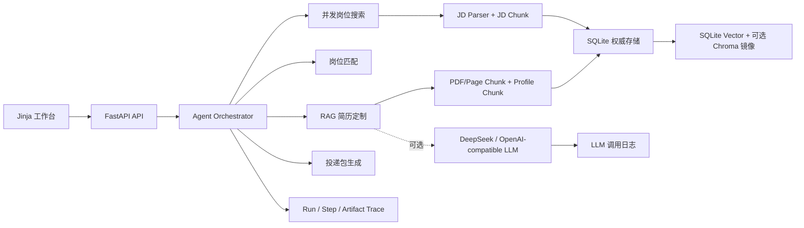

# CareerAgent

CareerAgent 是一个面向 Agent/LLM 应用开发实习岗位的求职助手 Agent。它不是单次 Prompt 演示，而是一个工程化工作流：从 PDF 简历或问答式信息采集开始，解析候选人画像，搜索真实招聘站岗位，存储并检索职位 JD，做岗位匹配评分，基于 RAG 证据定制简历，记录 LLM 调用与 Agent Trace，最后生成可人工确认的投递包。

默认演示场景是“Agent 开发实习生”，但数据模型和服务层可以扩展到其他技术岗位。

## 核心能力

- 简历来源：
  - 上传 PDF，使用 `pypdf` 提取页级文本。
  - 通过引导式问答生成结构化 Profile。
- PDF Chunk：
  - 页级 chunk、结构化字段 chunk、段落优先 + 滑窗兜底。
  - 每个 chunk 存储页码、字段、字符范围、切分策略等 metadata。
- JD 存储与检索：
  - 每个岗位的 JD 会入库为 `jobs`。
  - JD 会切分为 `job_chunks`，包括 required skills、responsibilities、qualifications、raw JD 等。
  - SQLite 保存权威数据和 embedding；Chroma 作为可选向量库镜像。
  - 默认接入 `sentence-transformers/paraphrase-multilingual-MiniLM-L12-v2` 真实 embedding，失败时记录原因并降级到 hash fallback。
  - 支持对一阶段 Top20 chunk 使用 CrossEncoder reranker，默认 Top5 作为召回锚点。
- 岗位来源：
  - 腾讯招聘公开职位接口。
  - Lever 公开岗位 API，可配置公司 slug。
- Agent 工作流：
  - `find_jobs_for_profile`：搜索岗位、解析 JD、入库、匹配、排序。
  - `tailor_resume_for_job`：匹配岗位、检索简历证据、定制简历、校验幻觉风险。
  - `quick_apply`：生成投递包、求职信、外联文案、投递清单和状态记录。
  - 每次 run 先生成 Plan-Execute 执行计划，并写入 Trace artifact。
- LLM 调试：
  - 记录调用名、模型、base_url、prompt 预览、response 预览、耗时、错误信息。
  - 不记录 API key。
- 量化评测：
  - 内置样例集 `evals/sample_cases.json`。
  - 输出 skill precision/recall、missing skill precision、evidence hit rate、pass rate 等指标。
- 可观测性：
  - `agent_runs`、`agent_steps`、`agent_artifacts` 记录每次工作流。
  - 可通过 UI 或 API 查看 Trace。

## 架构概览



## 快速启动

```bash
python -m venv .venv
.\.venv\Scripts\activate
pip install -r requirements.txt
copy .env.example .env
uvicorn app.main:app --reload
```

打开：

- 工作台：http://localhost:8000
- API 文档：http://localhost:8000/docs
- 健康检查：http://localhost:8000/health

## LLM 配置

不配置 LLM 时，系统会使用规则解析和确定性 fallback，测试与核心链路仍可运行。启用 DeepSeek 兼容接口时，在本地 `.env` 中填写：

```env
LLM_API_KEY=your_key_here
LLM_BASE_URL=https://llmapi.paratera.com
LLM_MODEL=DeepSeek-V4-Pro
```

不要提交 `.env` 和真实 API key。

## 主要页面

- `/ui/profiles`：上传 PDF 或问答式生成简历档案。
- `/ui/jobs`：搜索真实岗位或手动粘贴 JD。
- `/ui/agent-runs`：运行 Agent 并查看步骤。
- `/ui/resumes`：查看和下载定制简历版本。
- `/ui/applications`：查看投递包和投递状态。

## 常用 API

- `POST /profiles/upload`
- `POST /profiles/guided`
- `POST /jobs/search`
- `GET /jobs/{job_id}/chunks`
- `POST /agent/runs`
- `GET /agent/tools`
- `GET /agent/runs/{run_id}/steps`
- `POST /resumes/tailor`
- `GET /llm/debug/logs`
- `POST /evaluations/run`
- `POST /evaluations/pdf-chunk-strategies`
- `POST /evaluations/rag-strategies`
- `POST /evaluations/llm-workflow`
- `GET /evaluations/results`

更完整的接口说明见 [docs/API.md](docs/API.md)。

## 测试

```bash
pytest -q
```

当前测试覆盖：

- 健康检查。
- 前端页面渲染。
- 简历解析。
- 简历向量检索。
- Embedding service 和 reranker。
- JD chunk 存储与检索。
- 岗位匹配。
- Agent 简历定制工作流。
- LLM 调用日志。
- 样例集量化评测。

## 文档

- [架构设计](docs/ARCHITECTURE.md)
- [Agent 设计说明](docs/AGENT_DESIGN.md)
- [API 说明](docs/API.md)
- [PDF Chunk 方案](docs/PDF_CHUNKING.md)
- [量化评测方案](docs/EVALUATION.md)
- [开发说明](docs/DEVELOPMENT.md)
- [开发日志](docs/DEVELOPMENT_LOG.md)

## 投递策略说明

CareerAgent 会准备投递包和目标投递链接，但不会绕过招聘平台登录、隐私授权、筛选题和最终提交确认。真实求职场景里，最终提交必须由用户人工确认，避免错误提交个人信息，也避免违反招聘平台规则。
