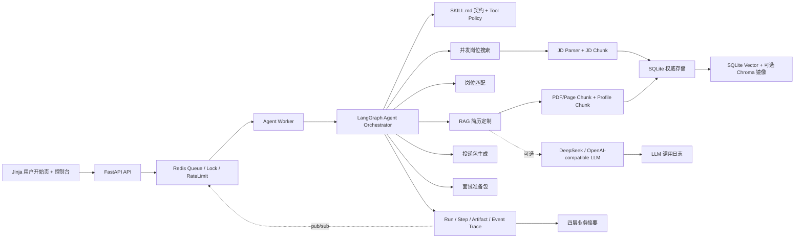

# CareerAgent

最新的可靠性与检索校准结果见 [SLO 与误差预算](docs/SLO.md) 和 [中文、英文与跨语言 RAG 校准](docs/RAG_MULTILINGUAL_CALIBRATION.md)。

上下文与 Token 治理见 [Context Runtime V2](docs/CONTEXT_RUNTIME_V2.md)、[Token Optimization V2](docs/TOKEN_OPTIMIZATION_V2.md)、[联合上线报告](docs/COMBINED_V2_PRODUCTION_RELEASE.md)、[上下文管理 V3 完整流程评测](docs/CONTEXT_MANAGEMENT_V3_PRODUCTION.md) 和 [对话任务状态 V4](docs/CONVERSATION_TASK_STATE_V4.md)。

CareerAgent 是一个面向 Agent/LLM 应用开发实习岗位的求职助手 Agent。它不是单次 Prompt 演示，而是一个工程化工作流：从自然语言需求、PDF 简历或问答式信息采集开始，解析候选人画像，搜索真实招聘站岗位，存储并检索职位 JD，做岗位匹配评分，基于 RAG 证据定制简历，记录 LLM 调用与 Agent Trace，生成可人工确认的投递包，并根据 JD、简历项目、RAG 证据、缺口技能和面经参考链接整理面试准备包。

默认演示场景是中文求职场景下的“Agent 开发实习生”，英文岗位只作为少量辅助测试；数据模型和服务层可以扩展到其他技术岗位。

## 90 秒看懂 CareerAgent

CareerAgent 的核心不是“让 LLM 写一段简历”，而是把真实求职任务变成一条可恢复、可审批、可量化的 Agent 工作流：

```text
PDF/结构化简历 + 中文目标岗位
-> 岗位匹配与能力缺口
-> RAG 检索真实经历证据
-> 证据约束简历定制
-> Guardrail 检查与一次 ReAct 修复
-> 人工审批投递材料/外发动作
-> 业务摘要 + LangGraph Trace + LLM 调用日志
```

开始页提供三条可复现的黄金路径：

| 路径 | 用户要解决的问题 | 重点产物 |
| --- | --- | --- |
| 岗位匹配 | 这份简历适合哪些中文 Agent 实习岗位，差距在哪里 | 匹配分、证据、已匹配/缺失技能 |
| 证据约束定制 | 如何按 JD 改简历，又不编造经历 | 定制简历、证据覆盖、Guardrail、repair trace |
| 审批式投递 | 如何准备并执行高风险投递动作 | 投递包、LangGraph interrupt、审批审计、外发结果 |

每次 run 都返回四层业务摘要：路由层解释选择了哪些 Skill/SubAgent/Tool，过程层展示工具成功率、修复和耗时，结果层展示岗位、简历和投递产物，副作用层展示审批与真实外发状态。演示脚本和验收口径见 [docs/GOLDEN_DEMOS.md](docs/GOLDEN_DEMOS.md)，机器可读场景位于 `evals/golden_demo_scenarios.json`。

## 为什么这些组件存在

| 业务问题 | 工程设计 |
| --- | --- |
| PDF 布局和噪声导致简历证据丢失 | 结构感知 Chunk、页码/字段 metadata、PDF Chunk 评测 |
| JD 关键词相同不代表经历真实 | SQLite 权威数据 + 向量召回 + CrossEncoder rerank + evidence type classifier |
| 长流程中断或刷新后任务丢失 | Redis 外部队列、LangGraph checkpointer、run recovery、业务幂等键 |
| LLM 可能编造项目或把缺口写成经验 | Evidence-constrained generation、Guardrail、一次 ReAct repair |
| 浏览器填写和邮件发送不可静默执行 | Tool Policy、审批表、LangGraph interrupt、RBAC、审计事件 |
| 最终文本好看但无法定位中间错误 | Run/Step/Artifact/Event、LLM 调用日志、四层业务摘要 |
| Tool 配置写了但执行时不生效 | Agent Tool Runtime、合同预检、单一重试所有权、持久化熔断 |
| 所有异常都触发 LLM repair 浪费成本 | ErrorEnvelope 分类与 LangGraph 定向恢复路由 |
| 多轮偏好和用户纠错无法跨 run 使用 | tenant/user/profile 隔离的 typed memory 与反馈复核闭环 |

## 核心能力

- 自然语言求职入口：
  - 用户可以直接描述“生成简历、修改上传简历、搜索岗位、按 JD 改简历、生成投递包、生成面试包”等需求。
  - `POST /assistant/natural-language` 本身也运行在 LangGraph `StateGraph` 上：解析意图、执行计划、一次 repair、最终汇总都是可追踪节点。
  - 失败不静默兜底：计划执行失败会触发 1 轮 repair，仍失败时返回 `status=failed`、Run ID、错误原因和可追踪步骤。
- 简历来源：
  - 上传 PDF，使用 `pypdf` 提取页级文本。
  - 通过中文简历栏目手动建档，基础信息固定保留，其余栏目可按需勾选；支持可选上传照片。
- PDF Chunk：
  - 页级 chunk、结构化字段 chunk、段落优先 + 滑窗兜底。
  - 每个 chunk 存储页码、字段、字符范围、切分策略等 metadata。
- JD 存储与检索：
  - 每个岗位的 JD 会入库为 `jobs`。
  - `JDParserService` 会抽取 required/preferred skills、responsibilities、qualifications、keywords 和 job_type。
  - 真实来源的结果列表路径使用 `parse_jd_for_search` 做确定性结构化和 Prompt Injection 检测，不等待逐岗位 LLM；显式 JD 深度解析、简历评审和定制仍使用真实 LLM。
  - JD parser 支持 Agent/RAG/LLM、向量库、reranker、A/B Testing、Feature Store、MLflow、Airflow、Kafka、推荐排序、Prompt Security 等技能别名归一化。
  - parser 会区分 required 与 preferred，并过滤 `No prior X required`、`不要求 X` 这类负向语境，避免把“可选/不要求”误写成硬性技能。
  - JD 会切分为 `job_chunks`，包括 required skills、responsibilities、qualifications、raw JD 等。
  - SQLite 保存权威数据和 embedding；Chroma 作为可选向量库镜像。
  - 默认接入 `sentence-transformers/paraphrase-multilingual-MiniLM-L12-v2` 真实 embedding，模型失败时直接报错，便于通过 Trace 定位问题。
  - 支持对一阶段 Top20 chunk 使用 CrossEncoder reranker，默认 Top5 作为召回锚点。
  - `EvidenceClassifier` 会区分 shipped project、metric evidence、coursework、planned learning 和 missing-skill disclosure，并影响 RAG 证据排序。
- 岗位来源：
  - 默认中文主链路接入 29 个适配器、40 个企业官方招聘门户：除腾讯、百度、美团、字节、阿里、京东等既有来源外，已接入小红书、哔哩哔哩、蚂蚁集团、360、得物；共享 Moka 浏览器源新增大疆、金山办公和中兴通讯。
  - 腾讯使用公开职位 JSON；百度读取公开 SSR 数据；美团使用搜索与详情 JSON；阿里动态发现实习批次并读取完整 JD。
  - 字节岗位接口需要官网动态 `_signature`，因此使用 Playwright 触发官网请求并捕获结构化 JSON，不硬编码签名，也不依赖 DOM selector。
  - 海外 ATS 只作为少量英文辅助，不进入默认中文链路；Greenhouse 这类中国招聘场景弱的源不作为核心能力接入。
  - Lever 公开岗位 API 仅作为显式开启的英文辅助岗位源，默认不参与中文主链路。
  - Source 层有确定性的中文岗位相关性排序，会优先提升 Agent/LLM/RAG、开发/工程和实习/校招信号，降低产品、销售、商务等不匹配岗位。
  - `real-job-source-smoke` 会单独记录岗位源可达性、返回数量、JD 非空率、投递链接率、query relevance、Agent/AI relevance、relevance score 和 source errors，不让外部网络波动影响核心回归。
  - `real-job-ingest-smoke` 单独验证真实 JD 的 LLM 解析、SQLite upsert、JD chunk、embedding/reranker provider、检索 probe 和 parser quality probe。
  - 用户岗位发现入口支持三种模式：只填求职需求、只提供简历、同时提供需求和简历；简历不是浏览岗位的前置条件。
  - `JobDiscoveryService` 会把岗位需求与 Profile 目标岗位/技能构造成跨岗位查询，对 `job_chunks` 做向量召回，并结合岗位相关性规则和 reranker 生成持久化搜索结果。
  - 跨岗位检索先用元数据和词法相关性缩小候选池，再做真实向量召回和岗位级二阶段重排；不会对 chunk 与岗位重复 rerank。
  - 历史 hash/旧维度向量在首次命中时批量迁移并写回 SQLite，后续搜索直接复用真实 embedding，避免每次临时重算。
  - `job_search_sessions/job_search_results` 保存搜索输入、来源错误、排序分数和可选的简历匹配结果；刷新或跨页后可以继续浏览同一批岗位。
- 面经来源：
  - 用户可以导入牛客网、OfferShow、小红书等同岗面经正文，系统只从原文抽取问题、轮次、主题和可信度。
  - `interview-source-smoke` 独立探测牛客网、OfferShow、小红书公开搜索页的可达性、空结果、面经信号、query relevance 和内容可抽取性，不绕过登录或反爬，也不影响核心面试包回归。
  - 面经正文难以稳定获取时，面试包只附上参考链接、标题和搜索入口；核心问题生成转向 JD、简历项目和 RAG 证据。
- Agent 工作流：
  - 主编排已经迁移到 LangGraph：所有 `/agent/runs`、自然语言 Agent 和 Agent full-flow 评测都通过 LangGraph `StateGraph` 运行；旧 `AgentOrchestrator` 类名只保留兼容 import。
  - `full_career_flow`：搜索/选择岗位、匹配、定制简历、投递包、面试包的一体化流程；适合 API 层验证完整链路。
  - `find_jobs_for_profile`：搜索岗位、解析 JD、入库、匹配、排序。
  - `tailor_resume_for_job`：匹配岗位、检索简历证据、定制简历、校验幻觉风险。
  - `quick_apply`：生成投递包、求职信、外联文案、投递清单和状态记录，并校验投递包是否编造事实或越过人工确认边界。
  - `prepare_interview_for_job`：使用成本受控的 Agentic RAG v3 子图生成面试包。默认 10 题，正常路径由问题生成、答案共享上下文 Batch 和 Verifier Batch 组成；本地 multi-query、按题目视角分配来源配额、exact/BM25/向量/RRF/Top20 reranker 召回证据，服务端只组合已验证 claims。JSON repair 最多 1 次、答案定向 repair 最多 2 轮，整个面试链业务调用不超过 8 次，并设置 100,000 Prompt 字符和 15,000 completion token 预留硬预算；release gate 未通过不落库。
  - `quick_apply` 前置 `fit_gate`：低匹配岗位直接阻断，并把缺口写入 Agent step trace。
  - 每次 run 先生成 Plan-Execute 执行计划，并写入 Trace artifact。
  - `execution_plan` 和 run 输入输出会标记 `orchestration_framework=langgraph`，并保留 `graph_thread_id`；当前使用 LangGraph SQLite checkpointer 持久化到 `data/runtime/langgraph_checkpoints.sqlite`。
  - `full_career_flow` 未指定 `job_id` 时会先在岗位排序后触发岗位选择 interrupt；用户选中岗位后才进入定制简历。`quick_apply` 和完整流程在生成投递包前还会触发独立的高风险确认 interrupt。
  - 支持后台启动和 LangGraph SSE 事件流：`POST /agent/runs/background` 返回 queued run 并写入 Redis 优先级队列，`scripts/run_agent_worker.py` 或 `scripts/run_agent_worker_supervisor.py` 独立消费执行，`GET /agent/runs/{run_id}/events/stream` 持续输出 graph/node/step/interrupt 进度。
  - 支持用户取消 run、stale run 检测、业务幂等键、投递审批审计、Redis run lock 和 Profile 级 active/rate limit。
  - Redis worker 支持 high/normal/low 优先级队列、Sentinel HA 连接、dead-letter queue、queued run recovery scanner 和更细粒度 heartbeat stage；控制台可查看队列长度、DLQ 预览，并人工选择重放或丢弃异常 payload。
  - 高风险动作统一绑定 approval table：`browser_apply`、`email_draft`、`email_send` 必须先有 approved 审批记录，工具执行网关才会执行 Playwright/SMTP/EML 工具，并把结果写回 artifact。
  - 支持多租户 RBAC 基础：`tenants/app_users` 表、session 登录、`X-Tenant-Id`、`X-User-Id`、`X-User-Roles` 可信 header 和 admin/ops/owner 角色保护运维接口；`profiles/jobs/agent_runs` 已写入并查询 `tenant_id`。
  - 提供外发工具 smoke：`/ui/outbound-smoke`、`/ui/outbound-smoke/target` 和 `docker-compose.smtp.yml` 本地 Mailpit SMTP。
  - JD、PDF 简历、RAG evidence 和导入面经进入 LLM 前会经过 PromptInjectionGuard 检测，风险写入结构化 metadata；prompt injection 评测按 release gate 校验总体和分 source/category 的最低召回率与最高误报率。
  - PromptInjectionGuard 有 adversarial 评测集，覆盖 JD/PDF/RAG/面经四类来源，输出 recall、false positive rate、severity accuracy 和分桶指标。
  - 首页只负责岗位发现，不会自动选择 Top1 或直接生成投递材料；用户先进入岗位结果页，在具体 JD 详情中按需进行匹配、差距分析和简历定制。
  - `skills/*/SKILL.md` 定义版本化 Skill 契约，包含触发条件、输入、允许调用的 Tool、上下文、输出契约、禁止行为、成功标准和失败策略。
  - Skill 采用渐进式披露：能力目录只返回 metadata，执行计划只携带任务所需契约，完整指令通过 Skill 详情接口按需读取。
  - Tool Policy 统一声明风险等级、审批要求、幂等策略、超时、重试、审计事件和 MCP 候选；Planner 会校验所有计划工具都被当前 Skill 明确授权。
  - `AgentToolRuntime` 在执行时兑现 Tool Policy：未注册工具拒绝、参数预检、timeout、输出合同、单层重试和跨 worker Circuit Breaker。
  - `ErrorEnvelope` 统一 Step、Graph、Run、worker 和 DLQ 的错误语义；只有缺输入/状态和完成门禁缺项会进入一次 LLM plan repair。
  - typed memory 只保存偏好、约束、选择、结果和用户纠错，不回放原始聊天；按 tenant/user/profile 隔离并受上下文预算约束。
  - 负反馈和低质量 run 自动进入 `agent_quality_reviews`，每次 plan 同时写模型、Tool 和 RAG 版本溯源 Artifact。
  - 显式注册 Tool、Skill 和 SubAgent，计划产物会展示当前任务使用的能力边界和权限校验结果。
  - 简历定制带 1 轮 ReAct repair loop：Guardrail 高风险时读取 issues 和压缩上下文，修复后再次验证，并记录 `react_repair` 元数据。
- LLM 上下文治理：
  - 渐进式披露是 LLM 调用前的 Runtime Policy，不单独包装成 SubAgent。
  - Context Runtime V2 为 Planner、Parser、Matcher、Tailor、Application、Interview、Verifier、Guardrail 和 Completion Gate 建立 11 份独立节点合同。
  - Control、Working、Evidence、Memory 和 Artifact Context 分开治理；完整 PDF、长 Tool Output 和历史产物默认只传 Artifact 引用。
  - 使用模型 Tokenizer 或显式标记的 Token 估算器分配节点预算；关键数字、否定事实、Citation、审批和 Tool Receipt 进入 Critical Fact Ledger，压缩后完整性不达标即拒绝。
  - 支持 Level 0 去重、Level 1 结构化投影、Level 2 Evidence Shard、Level 3 历史 Compaction 和 Level 4 Checkpoint/Handoff Context Reset。
  - JIT Loader 按 tenant/user/profile、当前操作白名单和 Token/调用预算展开 Profile、JD、Evidence、Artifact、Memory 或历史 Run 片段。
  - 当前默认 `CONTEXT_RUNTIME_V2_ENABLED=true`、`CONTEXT_RUNTIME_V2_SHADOW_MODE=false`；Context V2 与 Token V2 的独立消融和联合真实 canary 均已通过，实际生效版本写入每次 Run 的 Execution Provenance。
  - `CONTEXT_MANAGEMENT_V3_ENABLED=true`：正式流程按 Control、Task State、Profile/JD、Evidence、Conversation、Artifact/Receipt 六类治理；只有旧 Conversation 允许 LLM 压缩，Checkpoint 通过 `context_refs` 重建下一节点最小上下文。
  - Planner 在同一次调用中返回 plan 与 `state_updates`，Pydantic 校验后由确定性 `TaskStateReducer` 原子合并；正式任务状态进入 LangGraph Checkpoint，Conversation Summary 只保留非权威讨论背景。
  - V3 的 5 对真实完整流程质量门禁全部通过，但平均 Input/Total Token 增加 4.07%/4.38%；当前价值是隔离、恢复和事实完整性，不把早期窄切片收益外推为全流程节省。
- LLM 调试：
  - 记录调用名、模型、base_url、prompt 预览、response 预览、耗时、错误信息。
  - JD parser 对空返回/超时做带 trace 的业务层 retry，最多记录到 `jd_parser.parse_jd.retry_2`；截断或非法 JSON 会触发 `jd_parser.parse_jd.repair_json` 重新生成完整 strict JSON。
  - LLM workflow 会把 `evaluation_run_id`、`case_name` 和 `stage` 写入 `context_json`，评测页可以精确展示当前 run 的调用树。
  - 不记录 API key。
- 量化评测：
  - 内置样例集 `evals/sample_cases.json`。
  - 输出 skill precision/recall、missing skill precision、evidence hit rate、pass rate 等指标。
  - Agent full-flow 评测覆盖岗位搜索、匹配排序、简历定制、投递门禁、Trace 和 Artifact。
  - JD parser 评测用 30 个中英混合、带 preferred/negative/synonym 噪声的 JD case 衡量结构化质量。
  - Job relevance 评测用 13 个中文为主 query、130 个带 0-4 级人工相关性标注的候选岗位衡量 source 排序质量。
  - Application packet 评测用 27 个中文投递包 case 衡量求职信/外联文案的事实校验、跨语言改写、结果类声明、人工确认边界和误拦截率。
  - Interview prep 评测用 9 个中文为主 case 衡量面经源调研线索、已导入面经证据、项目技术栈追问、LLM 项目实现追问、LLM 八股/基础追问、缺口 drill、通用问题、题目 ID、来源分布、三类准备角度和 Markdown 交付质量。
  - Interview source smoke 单独衡量牛客网、OfferShow、小红书等外部面经来源健康度，核心面试包仍使用可控样例和用户导入文本保证可重复。
  - 真实岗位源 smoke 独立评估 source 层健康度，核心 full-flow 仍使用可控岗位源保证可重复。
  - 真实 JD ingest smoke 独立评估 parser/RAG 入库链路，并检查 query/title/JD 中的核心技能是否进入 structured JD，避免和 source 可达性混淆。
  - PDF Chunk、RAG 和 LLM workflow 都有独立评测集；LLM workflow 会真实跑简历解析、JD 解析、fit judge、简历定制和 Guardrail，并逐 case 写入中间 trace。
  - LLM workflow 支持 `resume_from_last_completed`，可以从 JSONL trace 中连续完成的 case 后继续长跑评测。
- 可观测性：
  - `agent_runs`、`agent_steps`、`agent_artifacts`、`agent_events` 记录每次工作流。
  - `agent_events` 会保存 `run_created/run_started/run_finished`、LangGraph node start/update/end、interrupt、step start/end/fail 和 artifact 事件。
  - 每个 run 生成 `business_summary` artifact，统一展示路由、过程、结果、副作用四层指标，不需要从原始 JSON 中猜测本次任务完成了什么。
  - 可通过 UI 或 API 查看 Trace。

## 产品演进

- V1：单份简历与单份 JD 的规则匹配。
- V2：PDF 结构感知 Chunk、SQLite JD/简历 Chunk 存储和 RAG 证据检索。
- V3：真实 embedding、Top20 + reranker、证据类型分类和量化评测。
- V4：LangGraph Plan-Execute、ReAct repair、持久化 checkpoint 和事件流。
- V5：Redis 外部队列、worker recovery、DLQ、优先级和业务幂等。
- V6：人工审批 interrupt、浏览器/邮件高风险工具网关和审计。
- V7：多租户 RBAC、Supervisor、健康探针、发布阈值和 Prompt Injection 评测。
- V8：版本化 `SKILL.md`、统一 Tool Policy、三条黄金演示和面向用户的四层业务摘要。
- V9：腾讯/百度/美团/字节/阿里五源中文岗位检索、动态批次/签名适配和真实多 query release suite。
- V10：统一 Agent Tool Runtime、ErrorEnvelope 定向恢复、持久化熔断、typed memory、用户反馈和在线质量复核。
- V11：Context/Token V2 正式默认、六类定向上下文、对话语义压缩、Checkpoint 引用恢复、长文档 Schema Batch 和面试共享上下文 Batch。
- V12：Planner 单调用状态增量、强类型 TaskState、确定性纠错/禁止操作 Reducer、摘要冲突校验和历史 Checkpoint 状态恢复。

## 当前文件架构

```text
CareerAgent/
├── app/                                  # FastAPI 产品代码
│   ├── main.py                           # 应用组合根与 Router 注册
│   ├── agents/                           # LangGraph、Planner、Skill/Tool/SubAgent 注册
│   │   ├── langgraph_orchestrator.py     # 主图、节点、路由、interrupt/resume
│   │   ├── natural_language.py           # 自然语言需求图与 plan repair
│   │   ├── skills.py                     # SKILL.md 加载与渐进式披露
│   │   ├── tools.py                      # Tool Policy 与权限校验
│   │   └── subagents.py                  # Agent 职责和上下文边界
│   ├── api/                              # Profile、Job、Run、审批、评测和运维 API
│   ├── services/                         # 简历、岗位、RAG、安全、队列等领域服务
│   ├── core/                             # 配置、SQLite、LLM、Redis、安全和遥测
│   ├── models/                           # SQLAlchemy 实体与 Pydantic Schema
│   ├── frontend/                         # Jinja 页面路由
│   ├── templates/                        # 用户页面与控制台
│   └── static/                           # CSS 和浏览器端交互
├── skills/                               # 7 个版本化 SKILL.md 能力契约
├── evals/                                # PDF/RAG/Agent/Injection 评测集与阈值
├── scripts/                              # Worker、Supervisor、数据生成和真实 smoke
├── tests/                                # API、Agent、RAG、安全、队列和前端回归
├── demo_resumes/                         # 可直接上传的演示 PDF
├── docs/                                 # 架构、接口、评测、开发和面试资料
├── data/                                 # 运行时数据库/向量/checkpoint，Git 忽略
├── logs/                                 # 运行时日志，Git 忽略
├── docker-compose.smtp.yml               # Mailpit SMTP smoke
├── .env.example                          # 无密钥配置模板
├── pyproject.toml                        # pytest/ruff 配置
└── requirements.txt                      # Python 依赖
```

完整到文件级的注释目录、模块依赖方向和“新增功能应该放在哪里”见 [项目目录说明](docs/PROJECT_STRUCTURE.md)。

## 架构概览



## 快速启动

```bash
python -m venv .venv
.\.venv\Scripts\activate
pip install -r requirements.txt
playwright install chromium
copy .env.example .env
uvicorn app.main:app --reload
```

`playwright install chromium` 用于字节跳动岗位源和浏览器外发工具；未安装时字节 Source 会显式写入 `source_errors`。

后台一键流程需要 Redis 和独立 worker：

```powershell
$env:REDIS_ENABLED='true'
$env:REDIS_URL='redis://localhost:6379/0'
python scripts/run_agent_worker.py
```

打开：

- 开始页：http://localhost:8000
- 控制台：http://localhost:8000/ui/ops
- API 文档：http://localhost:8000/docs
- 健康检查：http://localhost:8000/health

## LLM 配置

默认开发模式要求配置 LLM；LLM 缺失或调用失败会直接报错，并写入调用日志。测试时可以显式设置 `LLM_FALLBACK_ENABLED=true` 使用规则路径。正式链路使用按 Trace 路由的 DeepSeek Flash/Pro 组合，在本地 `.env` 中填写：

```env
LLM_API_KEY=your_key_here
LLM_BASE_URL=https://api.deepseek.com
LLM_MODEL=deepseek-v4-flash
LLM_ROUTING_ENABLED=true
LLM_FLASH_MODEL=deepseek-v4-flash
LLM_PRO_MODEL=deepseek-v4-pro
LLM_FLASH_TRACE_PREFIXES=natural_language.,resume_parser.,jd_parser.,evaluation.llm_judge_suitability,resume_tailor.,application.
LLM_PRO_TRACE_PREFIXES=resume_review.,interview_prep.,interview_agentic_rag.
LLM_FLASH_MAX_TOKENS_MULTIPLIER=1.15
LLM_THINKING_MODE=auto
LLM_RETRY_ATTEMPTS=1
LLM_RETRY_BACKOFF_SECONDS=0.75
```

不要提交 `.env` 和真实 API key。

`auto` 会在官方 DeepSeek V4 接口上发送 `thinking: disabled`，避免结构化 JSON 链路只返回 `reasoning_content` 而最终 `content` 为空。
`LLM_RETRY_ATTEMPTS` 只处理网络断连、429 和 5xx 等瞬时错误；每次失败都会写入 LLM 调用日志，业务解析错误仍直接报错。

路由依据 2026-07-22 的同样本实测：规划、简历/JD 解析、匹配、定制和投递走 Flash；简历深度建议与整个面试 Agentic RAG 走 Pro。Flash 节点只把 completion 上限提高 15%，不增加业务 repair 轮数；门禁失败仍直接报错。`LLM_MODEL` 是未命中任何前缀时的默认模型。要进行单模型对照，必须设置 `LLM_ROUTING_ENABLED=false`；`scripts/run_model_comparison_slice.py` 已强制执行这一点。

## 主要页面

- `/`：面向用户的一键开始页。先选择已有档案、上传 PDF 自动建档或跳转简历页建档，再填写岗位搜索条件或选择已有岗位；“快速示例”可一键切换岗位匹配、证据约束定制和审批式投递。页面会展示简历建档、岗位搜索/读取、匹配排序、定制简历、投递包、面试包 6 个阶段。
- `/ui/profiles`：上传 PDF 或按主流中文简历栏目手动生成简历档案；手动建档可自定义栏目、为教育/实习/项目/校园实践添加多段条目，并可选上传照片；“我的简历档案”支持一键打开 HTML 简历预览，并可在浏览器中打印或另存为 PDF。
- `/ui/jobs`：搜索真实岗位或手动粘贴 JD。
- `/ui/agent-runs`：求职历史记录。优先展示路由、过程、结果、副作用四层业务摘要，再按需展开阶段进度、LangGraph 事件和原始 Trace。
- `/ui/resumes`：查看定制简历版本；默认以 HTML 简历预览展示排版效果，保留 Markdown 下载用于调试或二次编辑。
- `/ui/applications`：查看投递包、投递状态、Guardrail issues/warnings 和人工确认边界。
- `/ui/prep`：导入同岗面经材料，生成和查看面试准备包，展示网上同岗面经、简历项目技术栈和其他可能面试问题三类准备角度，展示 LLM 连续追问、题目质量分、可点击定位的失败项、面经参考链接，导出 Markdown，并记录按题练习状态。兼容旧路径 `/ui/interview-prep`。
- `/ui/quality`：运行面经来源 smoke 和真实 LLM workflow smoke，查看最近评测结果、逐 case stage trace、当前 run 的 LLM retry/repair 调用树和 source 层健康度，并把候选面经人工确认后导入；导入成功后可带着 `experience_ids` 快速生成面试包。该页面从右上角“控制台”进入，兼容旧路径 `/ui/evaluations`。
- `/ui/ops`：右上角“控制台”入口。展示上线状态、脱敏配置、运行指标、后台任务和最近 LLM 调用日志；可在本机浏览器保存 `X-Admin-Token`，后续写操作自动带上管理令牌。

## 演示数据与真实 smoke

生成可上传测试的 PDF 简历：

```bash
python scripts/generate_demo_resumes.py
```

生成文件位于 `demo_resumes/`：

- `agent_intern_strong_resume.pdf`
- `agent_intern_noisy_resume.pdf`
- `backend_platform_resume.pdf`
- `ml_rag_partial_resume.pdf`

使用真实 LLM 配置跑用户链路 smoke：

```powershell
$env:LLM_API_KEY='your_key_here'
$env:LLM_BASE_URL='https://api.deepseek.com'
$env:LLM_ROUTING_ENABLED='true'
$env:LLM_THINKING_MODE='auto'
$env:LLM_FALLBACK_ENABLED='false'
python scripts/run_user_flow_smoke.py --pdf demo_resumes/agent_intern_strong_resume.pdf
```

该脚本会真实覆盖 PDF 简历解析、JD 解析、简历定制、投递包和面试包，失败时直接报错并留下 LLM 调用日志。

## 常用 API

- `POST /profiles/upload`
- `POST /profiles/guided`
- `POST /assistant/natural-language`
- `POST /jobs/search`
- `GET /jobs/{job_id}/chunks`
- `POST /agent/runs`
- `POST /agent/runs/background`
- `POST /agent/runs/{run_id}/cancel`
- `GET /agent/runs/{run_id}/approvals`
- `GET /agent/tools`
- `GET /agent/skills`
- `GET /agent/skills/{skill_name}`
- `GET /agent/subagents`
- `GET /agent/runs/{run_id}/steps`
- `GET /agent/runs/{run_id}/summary`
- `POST /resumes/tailor`
- `GET /profiles/{profile_id}/html`
- `GET /resumes/{resume_version_id}/html`
- `POST /interview-prep`
- `GET /interview-prep/{prep_id}/questions`
- `GET /interview-prep/{prep_id}/markdown`
- `GET /interview-prep/{prep_id}/practice`
- `PUT /interview-prep/{prep_id}/practice`
- `POST /interview-prep/experiences`
- `GET /interview-prep/experiences`
- `GET /llm/debug/logs`
- `POST /evaluations/run`
- `POST /evaluations/pdf-chunk-strategies`
- `POST /evaluations/rag-strategies`
- `POST /evaluations/agent-full-flow`
- `POST /evaluations/jd-parser`
- `POST /evaluations/job-relevance`
- `POST /evaluations/application-packet`
- `POST /evaluations/prompt-injection`
- `POST /evaluations/interview-prep`
- `POST /evaluations/interview-source-smoke`
- `POST /evaluations/real-job-source-smoke`
- `POST /evaluations/real-job-ingest-smoke`
- `POST /evaluations/llm-workflow`
- `POST /tasks/llm-workflow`
- `GET /tasks`
- `GET /ops/readiness`
- `GET /ops/metrics`
- `GET /ops/config`
- `GET /ops/llm-usage`
- `GET /ops/queue/status`
- `POST /ops/queue/recover-queued`
- `GET /ops/approvals`
- `POST /ops/approvals`
- `POST /ops/approvals/{approval_id}/decision`
- `GET /ops/agent-runs/stale`
- `POST /ops/agent-runs/mark-stale`
- `GET /evaluations/results`

更完整的接口说明见 [docs/API.md](docs/API.md)。

## 测试

```bash
pytest -q
```

当前测试覆盖：

- 健康检查。
- 前端页面渲染。
- 简历解析。
- 简历向量检索。
- Embedding service 和 reranker。
- JD chunk 存储与检索。
- 岗位匹配。
- Agent 简历定制工作流。
- LLM 调用日志。
- 样例集、PDF Chunk、RAG、Agent full-flow、JD parser、Job relevance、Application packet、Interview prep、真实岗位源 smoke、真实 JD ingest smoke、LLM workflow 量化评测。

## 权限与运维

- `ADMIN_API_KEY`：配置后，`/ops/config` 和后台任务入队等管理操作需要 `X-Admin-Token`。
- `REQUIRE_ADMIN_FOR_MUTATIONS=true`：开启后，所有 `POST/PUT/PATCH/DELETE` 写操作都需要 `X-Admin-Token`，适合演示“读写权限隔离”。
- `/ops/readiness`：检查数据库、LLM 配置、embedding/reranker provider。
- `/ops/metrics`：查看请求数、平均延迟、状态码分布、Agent run/task/LLM call 状态分布和最近评测摘要。
- `/ops/llm-usage`：按最近时间窗聚合供应商实际返回的输入、输出和总 Token，并按模型、workflow、单次 workflow run 和 trace 分组；不会把缺失 usage 的调用记成 0。
- `/tasks/llm-workflow`：把真实 LLM workflow 放到后台执行，前端轮询 `/tasks` 展示进度，适合 18-case 长跑。
- `/ui/ops`：提供这些运维接口的前端面板，在控制台展示 LLM Token 用量，并支持保存本机 Admin Token；用户面试页不展示费用或 Token 数据。

## 文档

- [文档导航](docs/README.md)
- [完整系统设计、评测与 Bad Case 治理](docs/CAREER_AGENT_SYSTEM_DESIGN_AND_EVALUATION.md)
- [项目目录说明](docs/PROJECT_STRUCTURE.md)
- [架构设计](docs/ARCHITECTURE.md)
- [Agent 设计说明](docs/AGENT_DESIGN.md)
- [Redis + SQLite 架构说明](docs/CAREER_AGENT_REDIS_SQLITE_ARCHITECTURE.md)
- [Production Hardening Notes](docs/CAREER_AGENT_HARDENING_NOTES.md)
- [面试 Hardening Q&A](docs/CAREER_AGENT_INTERVIEW_HARDENING_QA.md)
- [API 说明](docs/API.md)
- [PDF Chunk 方案](docs/PDF_CHUNKING.md)
- [量化评测方案](docs/EVALUATION.md)
- [开发说明](docs/DEVELOPMENT.md)
- [开发日志](docs/DEVELOPMENT_LOG.md)

## 投递策略说明

CareerAgent 会准备投递包和目标投递链接，但不会绕过招聘平台登录、隐私授权、筛选题和最终提交确认。真实求职场景里，最终提交必须由用户人工确认，避免错误提交个人信息，也避免违反招聘平台规则。
