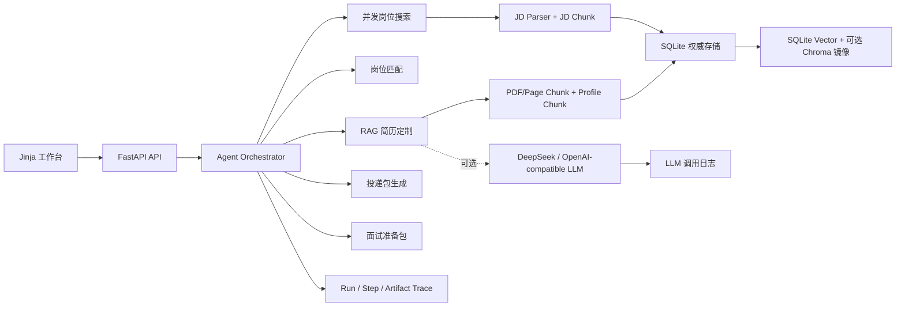

# CareerAgent

CareerAgent 是一个面向 Agent/LLM 应用开发实习岗位的求职助手 Agent。它不是单次 Prompt 演示，而是一个工程化工作流：从 PDF 简历或问答式信息采集开始，解析候选人画像，搜索真实招聘站岗位，存储并检索职位 JD，做岗位匹配评分，基于 RAG 证据定制简历，记录 LLM 调用与 Agent Trace，生成可人工确认的投递包，并根据 JD、简历项目、RAG 证据、缺口技能和面经参考链接整理面试准备包。

默认演示场景是中文求职场景下的“Agent 开发实习生”，英文岗位只作为少量辅助测试；数据模型和服务层可以扩展到其他技术岗位。

## 核心能力

- 简历来源：
  - 上传 PDF，使用 `pypdf` 提取页级文本。
  - 通过引导式问答生成结构化 Profile。
- PDF Chunk：
  - 页级 chunk、结构化字段 chunk、段落优先 + 滑窗兜底。
  - 每个 chunk 存储页码、字段、字符范围、切分策略等 metadata。
- JD 存储与检索：
  - 每个岗位的 JD 会入库为 `jobs`。
  - `JDParserService` 会抽取 required/preferred skills、responsibilities、qualifications、keywords 和 job_type。
  - JD parser 支持 Agent/RAG/LLM、向量库、reranker、A/B Testing、Feature Store、MLflow、Airflow、Kafka、推荐排序、Prompt Security 等技能别名归一化。
  - parser 会区分 required 与 preferred，并过滤 `No prior X required`、`不要求 X` 这类负向语境，避免把“可选/不要求”误写成硬性技能。
  - JD 会切分为 `job_chunks`，包括 required skills、responsibilities、qualifications、raw JD 等。
  - SQLite 保存权威数据和 embedding；Chroma 作为可选向量库镜像。
  - 默认接入 `sentence-transformers/paraphrase-multilingual-MiniLM-L12-v2` 真实 embedding，模型失败时直接报错，便于通过 Trace 定位问题。
  - 支持对一阶段 Top20 chunk 使用 CrossEncoder reranker，默认 Top5 作为召回锚点。
  - `EvidenceClassifier` 会区分 shipped project、metric evidence、coursework、planned learning 和 missing-skill disclosure，并影响 RAG 证据排序。
- 岗位来源：
  - 腾讯招聘公开职位接口，作为中文主场景岗位源。
  - 海外 ATS 只作为少量英文辅助，不进入默认中文链路；Greenhouse 这类中国招聘场景弱的源不作为核心能力接入。
  - Lever 公开岗位 API 仅作为显式开启的英文辅助岗位源，默认不参与中文主链路。
  - Source 层有确定性的中文岗位相关性排序，会优先提升 Agent/LLM/RAG、开发/工程和实习/校招信号，降低产品、销售、商务等不匹配岗位。
  - `real-job-source-smoke` 会单独记录岗位源可达性、返回数量、JD 非空率、投递链接率、query relevance、Agent/AI relevance、relevance score 和 source errors，不让外部网络波动影响核心回归。
  - `real-job-ingest-smoke` 单独验证真实 JD 的 LLM 解析、SQLite upsert、JD chunk、embedding/reranker provider、检索 probe 和 parser quality probe。
- 面经来源：
  - 用户可以导入牛客网、OfferShow、小红书等同岗面经正文，系统只从原文抽取问题、轮次、主题和可信度。
  - `interview-source-smoke` 独立探测牛客网、OfferShow、小红书公开搜索页的可达性、空结果、面经信号、query relevance 和内容可抽取性，不绕过登录或反爬，也不影响核心面试包回归。
  - 面经正文难以稳定获取时，面试包只附上参考链接、标题和搜索入口；核心问题生成转向 JD、简历项目和 RAG 证据。
- Agent 工作流：
  - `find_jobs_for_profile`：搜索岗位、解析 JD、入库、匹配、排序。
  - `tailor_resume_for_job`：匹配岗位、检索简历证据、定制简历、校验幻觉风险。
  - `quick_apply`：生成投递包、求职信、外联文案、投递清单和状态记录，并校验投递包是否编造事实或越过人工确认边界。
  - `prepare_interview_for_job`：基于 JD、匹配结果、RAG 证据和已导入同岗面经生成面试准备包，显式按“网上同岗位面经、简历项目技术栈、其他可能面试问题”三类准备角度组织问题。真实入口会调用 LLM 生成项目实现追问和八股/基础追问链，面经只作为参考链接和标题，不再把抓正文作为核心依赖。
  - `quick_apply` 前置 `fit_gate`：低匹配岗位直接阻断，并把缺口写入 Agent step trace。
  - 每次 run 先生成 Plan-Execute 执行计划，并写入 Trace artifact。
  - 显式注册 Tool、Skill 和 SubAgent，计划产物会展示当前任务使用的能力边界。
  - 简历定制带 1 轮 ReAct repair loop：Guardrail 高风险时读取 issues 和压缩上下文，修复后再次验证，并记录 `react_repair` 元数据。
- LLM 上下文治理：
  - 渐进式披露是 LLM 调用前的 runtime policy，不单独包装成 subagent。
  - `ContextCompressor` 按 Profile 摘要、JD 摘要、Top evidence 和 Prompt Packet 总预算生成上下文。
  - 压缩结果记录字符预算、压缩比例、保留证据数和收缩事件，便于排查长上下文和幻觉问题。
- LLM 调试：
  - 记录调用名、模型、base_url、prompt 预览、response 预览、耗时、错误信息。
  - JD parser 对空返回/超时做带 trace 的业务层 retry，最多记录到 `jd_parser.parse_jd.retry_2`；截断或非法 JSON 会触发 `jd_parser.parse_jd.repair_json` 重新生成完整 strict JSON。
  - LLM workflow 会把 `evaluation_run_id`、`case_name` 和 `stage` 写入 `context_json`，评测页可以精确展示当前 run 的调用树。
  - 不记录 API key。
- 量化评测：
  - 内置样例集 `evals/sample_cases.json`。
  - 输出 skill precision/recall、missing skill precision、evidence hit rate、pass rate 等指标。
  - Agent full-flow 评测覆盖岗位搜索、匹配排序、简历定制、投递门禁、Trace 和 Artifact。
  - JD parser 评测用 30 个中英混合、带 preferred/negative/synonym 噪声的 JD case 衡量结构化质量。
  - Job relevance 评测用 13 个中文为主 query、130 个带 0-4 级人工相关性标注的候选岗位衡量 source 排序质量。
  - Application packet 评测用 20 个中文投递包 case 衡量求职信/外联文案的事实校验、人工确认边界和误拦截率。
  - Interview prep 评测用 9 个中文为主 case 衡量面经源调研线索、已导入面经证据、项目技术栈追问、LLM 项目实现追问、LLM 八股/基础追问、缺口 drill、通用问题、题目 ID、来源分布、三类准备角度和 Markdown 交付质量。
  - Interview source smoke 单独衡量牛客网、OfferShow、小红书等外部面经来源健康度，核心面试包仍使用可控样例和用户导入文本保证可重复。
  - 真实岗位源 smoke 独立评估 source 层健康度，核心 full-flow 仍使用可控岗位源保证可重复。
  - 真实 JD ingest smoke 独立评估 parser/RAG 入库链路，并检查 query/title/JD 中的核心技能是否进入 structured JD，避免和 source 可达性混淆。
  - PDF Chunk、RAG 和 LLM workflow 都有独立评测集；LLM workflow 会真实跑简历解析、JD 解析、fit judge、简历定制和 Guardrail，并逐 case 写入中间 trace。
  - LLM workflow 支持 `resume_from_last_completed`，可以从 JSONL trace 中连续完成的 case 后继续长跑评测。
- 可观测性：
  - `agent_runs`、`agent_steps`、`agent_artifacts` 记录每次工作流。
  - 可通过 UI 或 API 查看 Trace。

## 架构概览



## 快速启动

```bash
python -m venv .venv
.\.venv\Scripts\activate
pip install -r requirements.txt
copy .env.example .env
uvicorn app.main:app --reload
```

打开：

- 工作台：http://localhost:8000
- API 文档：http://localhost:8000/docs
- 健康检查：http://localhost:8000/health

## LLM 配置

默认开发模式要求配置 LLM；LLM 缺失或调用失败会直接报错，并写入调用日志。测试时可以显式设置 `LLM_FALLBACK_ENABLED=true` 使用规则路径。启用 DeepSeek 兼容接口时，在本地 `.env` 中填写：

```env
LLM_API_KEY=your_key_here
LLM_BASE_URL=https://llmapi.paratera.com
LLM_MODEL=DeepSeek-V4-Pro
```

不要提交 `.env` 和真实 API key。

## 主要页面

- `/ui/profiles`：上传 PDF 或问答式生成简历档案。
- `/ui/jobs`：搜索真实岗位或手动粘贴 JD。
- `/ui/agent-runs`：运行 Agent 并查看步骤。
- `/ui/resumes`：查看和下载定制简历版本。
- `/ui/applications`：查看投递包、投递状态、Guardrail issues/warnings 和人工确认边界。
- `/ui/interview-prep`：导入同岗面经材料，生成和查看面试准备包，展示网上同岗面经、简历项目技术栈和其他可能面试问题三类准备角度，展示 LLM 连续追问、题目质量分、可点击定位的失败项、面经参考链接，导出 Markdown，并记录按题练习状态。
- `/ui/evaluations`：运行面经来源 smoke 和真实 LLM workflow smoke，查看最近评测结果、逐 case stage trace、当前 run 的 LLM retry/repair 调用树和 source 层健康度，并把候选面经人工确认后导入；导入成功后可带着 `experience_ids` 快速生成面试包。

## 常用 API

- `POST /profiles/upload`
- `POST /profiles/guided`
- `POST /jobs/search`
- `GET /jobs/{job_id}/chunks`
- `POST /agent/runs`
- `GET /agent/tools`
- `GET /agent/skills`
- `GET /agent/subagents`
- `GET /agent/runs/{run_id}/steps`
- `POST /resumes/tailor`
- `POST /interview-prep`
- `GET /interview-prep/{prep_id}/questions`
- `GET /interview-prep/{prep_id}/markdown`
- `GET /interview-prep/{prep_id}/practice`
- `PUT /interview-prep/{prep_id}/practice`
- `POST /interview-prep/experiences`
- `GET /interview-prep/experiences`
- `GET /llm/debug/logs`
- `POST /evaluations/run`
- `POST /evaluations/pdf-chunk-strategies`
- `POST /evaluations/rag-strategies`
- `POST /evaluations/agent-full-flow`
- `POST /evaluations/jd-parser`
- `POST /evaluations/job-relevance`
- `POST /evaluations/application-packet`
- `POST /evaluations/interview-prep`
- `POST /evaluations/interview-source-smoke`
- `POST /evaluations/real-job-source-smoke`
- `POST /evaluations/real-job-ingest-smoke`
- `POST /evaluations/llm-workflow`
- `GET /evaluations/results`

更完整的接口说明见 [docs/API.md](docs/API.md)。

## 测试

```bash
pytest -q
```

当前测试覆盖：

- 健康检查。
- 前端页面渲染。
- 简历解析。
- 简历向量检索。
- Embedding service 和 reranker。
- JD chunk 存储与检索。
- 岗位匹配。
- Agent 简历定制工作流。
- LLM 调用日志。
- 样例集、PDF Chunk、RAG、Agent full-flow、JD parser、Job relevance、Application packet、Interview prep、真实岗位源 smoke、真实 JD ingest smoke、LLM workflow 量化评测。

## 文档

- [架构设计](docs/ARCHITECTURE.md)
- [Agent 设计说明](docs/AGENT_DESIGN.md)
- [API 说明](docs/API.md)
- [PDF Chunk 方案](docs/PDF_CHUNKING.md)
- [量化评测方案](docs/EVALUATION.md)
- [开发说明](docs/DEVELOPMENT.md)
- [开发日志](docs/DEVELOPMENT_LOG.md)

## 投递策略说明

CareerAgent 会准备投递包和目标投递链接，但不会绕过招聘平台登录、隐私授权、筛选题和最终提交确认。真实求职场景里，最终提交必须由用户人工确认，避免错误提交个人信息，也避免违反招聘平台规则。
