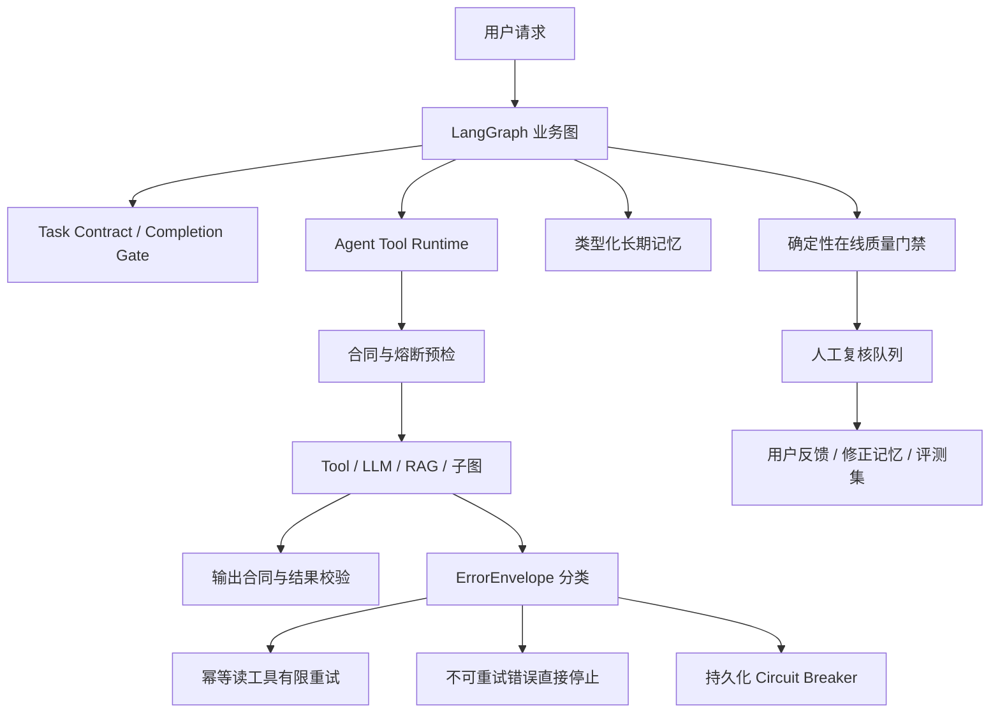

# 成熟 Agent 运行治理与 Bad Case 处理

## 0. 2026-08-11 二次成熟度审计结论

CareerAgent 当前不是靠“LLM 自己反思”处理所有失败，而是采用分层闭环：

```text
计划契约 -> Tool 强类型 preflight -> 有界执行 -> 结果合同
        -> RAG Evidence Gate / 业务 Guardrail
        -> SQLite 产物与 lineage 回查 -> Completion Gate
        -> Online Quality / 人工复核 / bad case 回流
```

本轮新增四个关键边界：

- RAG v2 对证据正文去重，统计每条支持度、语义类型和 multi-query 覆盖；不足时只做一次类型过滤检索修复，然后明确拒绝生成。
- Tool Runtime 不再只验字段存在，而是校验类型、正 ID/TopK、ORM 输出和外发状态枚举。
- Trace 除相同输入外，还识别“参数在变但结果不变”的无进展循环。
- Completion Gate v2 不信任 LangGraph state 中孤立的 ID，会回查 SQLite 的实体存在性、profile/job lineage 和 lifecycle。

因此，RAG 错误不会直接污染简历，Tool 返回 200/正常 return 也不自动等于成功，图到达 `END` 更不自动等于业务完成。

## 1. 这次升级解决的不是“再加几个节点”

CareerAgent 已经有 LangGraph、RAG、审批、Redis worker、checkpoint 和 Completion Gate，但在这次升级前仍有五个生产级缺口：

1. Tool Policy 只是一份可展示的元数据，执行时没有统一兑现超时、重试、输入输出合同和熔断。
2. 异常只有字符串，Planner、worker 和运维无法区分“重试能好”“需要用户补资料”“策略明确阻断”和“代码错误”。
3. 自然语言 Agent 遇到任何错误都会调用 LLM repair，配置错误、预算耗尽和依赖熔断也会白白消耗 Token。
4. 系统只有一次 run 的工作状态，没有受治理的长期记忆、用户纠错和线上失败回流。
5. Prompt、模型路由、RAG 配置和 Tool 合同没有统一版本指纹，出现回归时难以回答“这次结果到底由哪套配置生成”。

本轮把这些能力收敛为统一 Agent Runtime。LangGraph 继续负责业务状态机，Runtime 负责每个节点之外的执行治理。



## 2. Tool 合同从文档变成运行时约束

`app/agents/tools.py` 中每个 Tool 声明以下内容：

- 输入和输出合同；
- 风险等级、审批要求和副作用；
- 幂等策略；
- 超时；
- 最大尝试次数与允许重试的错误；
- `retry_owner`，即重试由 Runtime、LLM Client、业务 Handler 还是 Orchestrator 负责；
- Tool 合同版本。

`AgentToolRuntime` 在每次 `TraceService.step` 内统一执行：

1. 未注册 Tool 在严格模式下直接拒绝，防止 LLM 或代码拼出不存在的工具名。
2. 调用前检查必需参数和持久化熔断状态。
3. 使用 Tool 自己的超时预算执行异步 Handler。
4. 调用后检查非空结果和关键 Tool 的结构约束。
5. 失败时生成 `ErrorEnvelope`，写入 attempt Event 和 step failure。
6. 只有合同明确允许、错误可重试且 `retry_owner=runtime` 时才重试。
7. 高风险 `browser_apply/email_draft/email_send` 仍必须先通过 approval table，执行时也进入 Runtime 合同与熔断记录，但绝不自动重放外部副作用。

这解决了一个常见误区：Tool 列表里写了 `timeout=30`、`max_attempts=2`，不代表系统真的有超时和重试。必须由统一执行层读取并兑现这些字段。

## 3. 稳定错误分类与定向恢复

`ErrorEnvelope` 包含 `error_id/category/code/message/retryable/recovery_action/origin/occurred_at`。当前主要类别如下：

| 类别 | 示例 | 自动处理 |
| --- | --- | --- |
| `dependency_timeout` | 招聘站、Redis 或模型连接超时 | 幂等读 Tool 有限重试，超过阈值进 DLQ |
| `dependency_transient` | 连接断开、SQLite 临时锁、SMTP 网络失败 | 读操作有限重试；外发操作只记录，不自动重放 |
| `dependency_circuit_open` | 同一依赖连续失败达到阈值 | 立即失败，等待冷却或运维人工 reset |
| `input_or_state_validation` | 缺少 Profile、Job、JD 或状态不一致 | 自然语言图允许一次有界 replan |
| `insufficient_evidence` | RAG 结果存在但不足以支撑简历改写 | 阻止事实敏感生成，要求补证据或改查询 |
| `model_response_invalid` | JSON/结构化响应不合法 | 由唯一的结构修复层处理，Runtime 不叠加重试 |
| `configuration_error` | API Key、SMTP 或浏览器依赖未配置 | 直接失败，不调用 LLM replan |
| `model_budget_exceeded` | 工作流 Token/调用预算耗尽 | 直接失败，检查上下文与预算 |
| `completion_gate_rejected` | 声称完成但 Goal/Artifact 缺失 | 只补缺失目标，一次后仍失败则停止 |
| `execution_budget_exceeded` | 相同工具无进展循环或步骤过多 | 停止并检查规划，不继续烧 Token |
| `policy_or_human_interrupt` | 等待审批、用户取消、业务撤回 | 等用户或终止，不当成技术重试 |
| `internal_invariant_violation` | KeyError、类型错误、跨产物 ID 串线 | 进入质量复核，修代码而不是让 LLM 猜 |

自然语言 LangGraph 只允许 `input_or_state_validation` 和 `completion_gate_rejected` 进入一次 plan repair。配置错误、依赖熔断、预算耗尽和代码错误会直接进入失败终点。这既减少无意义 Token 消耗，也避免 repair Prompt 把基础设施错误误解释成业务计划问题。

## 4. 避免重试风暴：单一重试所有权

成熟系统最危险的不是“没有重试”，而是每层都在重试：HTTP Client 重试 2 次、LLM Client 重试 2 次、Tool Runtime 重试 2 次、worker 再重试 3 次，最坏会把一次请求放大成 24 次调用。

CareerAgent 的规则是：

- 招聘源等幂等读取由 Tool Runtime 重试；
- LLM HTTP 由 `LLMClient` 重试，JSON repair 由对应业务 Handler 负责；
- 简历 Guardrail repair 由 ResumeTailor ReAct loop 负责；
- LangGraph 只做状态级恢复和缺目标修复；
- Redis worker 读取 `ErrorEnvelope.retryable`，不可重试的 poison payload 第一次就进入 DLQ；
- 邮件发送、网页提交等外部副作用永不自动重试。

底层等待策略采用 capped exponential backoff with full jitter，而不是固定间隔或线性退避。LLM Client 只重试 transport error、HTTP 408/429/5xx，并解析服务端 `Retry-After`；配置/鉴权/普通 4xx/预算/质量门控失败立即停止。若 `Retry-After` 已超过当前交互延迟预算，系统不会提前撞上游，也不会无限挂起，而是记录 `retry_after_exceeds_latency_budget` 后向上返回失败。每个 HTTP attempt 都计入 `LLMCallBudget.max_http_attempts`，因此重试不能绕过成本上限。

这里区分两种容易混淆的“再试一次”：

- **Transient retry**：请求语义不变，等待依赖恢复；只适合幂等请求和暂时性故障。
- **Semantic repair**：Prompt 必须带回 schema、引用或任务门控的具体失败原因，让模型生成修正版；由业务层的 `max_repair_calls` 单独限制，不能被 HTTP retry 代替。

实现依据与边界参考 LangGraph 的 per-node RetryPolicy/timeout/error handler、Durable Execution 对 checkpoint 与幂等副作用的要求，以及 AWS 对 bounded exponential backoff、jitter 和 idempotency token 的建议。最大尝试次数和等待上限仍是产品 SLO/Token 预算参数，不从这些文档中的示例数字照抄。

## 5. 持久化 Circuit Breaker

`tool_circuit_states` 保存 Tool、作用域、连续失败次数、最后错误类别和冷却时间。连续可重试依赖错误达到阈值后状态变为 `open`；冷却结束后只允许 half-open 探测，成功才关闭。

为什么不能只做进程内计数：CareerAgent 有多个 Redis worker，进程内熔断会让每个 worker 都重新撞一次故障依赖。持久化状态能让多个 worker 共享故障认知。控制台 API 可查看并人工 reset 熔断器。

## 6. 分层记忆，而不是无限回放聊天记录

长期记忆采用 `agent_memories` 类型化表，只允许：

- `preference`：目标方向、城市、岗位偏好；
- `constraint`：排除公司、不可接受条件；
- `decision`：用户明确选择过的岗位；
- `outcome`：投递材料已准备但未发送等结果；
- `correction`：用户指出的错误事实或禁用表述。

系统不会把整段历史对话直接塞回 Prompt。检索时按 `tenant_id + user_id + profile_id` 隔离，按条数和字符预算压缩，只注入结构化事实。新值会把同 key 的旧值标记为 `superseded`，用户可查看和停用记忆。

这里特意区分三种状态：

- LangGraph checkpoint：一次 run 的短期工作状态；
- Profile/Job/Artifact：权威业务事实；
- AgentMemory：跨 run 的偏好、决策、结果和用户纠错。

三者不能混为“memory”。否则 checkpoint 会无限增长，聊天摘要会覆盖业务事实，或一个用户的偏好进入另一个用户的 Prompt。

## 7. 用户反馈与在线质量闭环

用户可对 run 提交 `helpful/incorrect/incomplete/unsafe`、1-5 分、原因标签和结构化纠错。负反馈会：

1. 写入 `agent_feedback`；
2. 创建 `agent_quality_reviews` 人工复核项；
3. 有纠错内容时写入 `correction` 记忆，防止后续再次使用错误事实。

每次 run 结束还会执行不调用 LLM 的 `OnlineAgentQualityService`：检查 terminal status、失败步骤、未知 Tool、Completion Gate、RAG quality 和 ErrorEnvelope，得到质量分。低于阈值的 run 自动进入复核队列。LLM-as-Judge 仍适合离线质量评测，但不作为每次生产请求的唯一门禁，避免成本、延迟和 Judge 自身不稳定。

## 8. Prompt、模型和 RAG 版本溯源

每次 LLM 调用日志新增：

- Prompt bundle SHA-256；
- Prompt 观测合同版本；
- 模型路由策略版本；
- 实际 routed model 和 route name；
- Token usage 与 provider usage。

每个计划新增 `execution_provenance` Artifact，记录应用版本、Runtime 合同、Tool 合同 hash、模型路由、thinking mode、embedding、reranker、RRF 和安全策略。Prompt 预览和响应预览会脱敏 API Key、Bearer Token、邮箱和手机号；Token 指标不会因为字段名含 `token` 被误删。

## 9. 本轮发现并固化的 Bad Case

### Bad Case A：Tool Policy 看起来完整，运行时却没有执行

**现象：** Tool 定义有 timeout/retry，但 `TraceService` 直接 `await handler()`。

**原因：** 配置层和执行层分离，没有 Runtime 读取元数据。

**修复：** 所有 Trace step 统一进入 `AgentToolRuntime`，测试真实制造断连、重试、恢复和熔断。

### Bad Case B：所有错误都让 LLM repair

**现象：** API Key 未配置或 circuit open 仍调用计划修复模型。

**风险：** 无法解决问题，还会继续消耗余额并污染 Trace。

**修复：** ErrorEnvelope 驱动 LangGraph 条件路由，只有业务状态可修复错误进入一次 replan。

### Bad Case C：多层重试导致调用指数放大

**现象：** Tool、LLM、worker 和图恢复可能同时重试。

**修复：** `retry_owner` 明确唯一责任层；worker 尊重 `retryable`，外发 Tool 永不自动重放。

### Bad Case D：新建 ORM 熔断对象的 Python 默认值是 None

**现象：** 测试第一次记录失败时，`consecutive_failures += 1` 抛出 `NoneType` 错误。

**原因：** SQLAlchemy `default=0` 在 INSERT 时生效，不保证对象构造后立刻是 0。

**修复：** 构造时显式赋 `status="closed", consecutive_failures=0`，更新时再用 `int(value or 0)`。这个问题如果只测成功路径不会被发现。

### Bad Case E：严格 Tool 注册让旧 `demo.tool` 测试失败

**现象：** 原执行预算测试使用随意命名的 Tool，严格模式正确拒绝。

**处理：** 没有放宽生产约束，而是把测试改成真实注册的 `LangGraph.AgentPlanner`。测试夹具不应要求产品保留不安全行为。

### Bad Case F：长期记忆造成同租户跨用户污染

**现象：** 最初只按 tenant/profile 查询记忆，同一租户的其他用户偏好可能进入当前 Prompt。

**修复：** `AgentRun` 持久化 `user_id`，查询限定为当前用户私有记忆和显式共享记忆；run 子资源、SSE 和反馈接口也使用 owner scope。

### Bad Case G：诊断脱敏误伤 Token 指标

**风险：** 如果按字段名包含 `token` 全部脱敏，`prompt_tokens/total_tokens` 会消失，控制台成本统计再次失真。

**修复：** 敏感字段使用精确 key 集合，`prompt_tokens` 保留；字符串中的 API Key 和 Bearer 凭证使用模式脱敏。

### Bad Case H：不可重试 poison message 仍排队三次

**现象：** worker 对缺 run、参数错误等确定性失败统一 `requeue_or_dead_letter`。

**修复：** queue payload 保存 ErrorEnvelope，不可重试错误第一次即 DLQ，并标记 `terminal_reason=non_retryable_error`。

## 10. 当前仍不应声称已经解决的内容

1. SQLite 熔断状态适合当前单机/中等并发；多实例高吞吐部署应迁移 PostgreSQL 或 Redis 原子状态机。
2. Online Quality Gate 是确定性控制面，不等于真实用户质量分；仍需人工抽样、真实反馈和版本化离线回放。
3. 类型化记忆已经有 API 和 Prompt 注入，但尚未做基于 embedding 的大规模 memory retrieval；当前数据量下按 scope、类型和新鲜度读取更可解释。
4. Prompt 指纹能定位版本，不能自动证明 Prompt 更好；发布时仍需用固定数据集比较。
5. 浏览器提交和邮件发送的最终 outcome 还应增加招聘站确认号、邮件 Message-ID 等外部状态核验。
