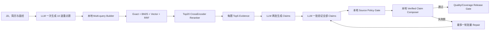

# 架构设计

CareerAgent 的目标不是“一个 Prompt 生成简历”，而是一个可观测、可评测、可扩展的求职 Agent 工程。

仓库的完整文件树、每个文件职责和新增功能放置规则见 [项目目录说明](PROJECT_STRUCTURE.md)。

## 分层

- `app/api`：FastAPI 路由层，负责请求校验、DB Session 注入和服务编排。
- `app/frontend`：Jinja 页面路由，提供本地工作台。
- `app/agents`：LangGraph Agent 工作流编排、Tool Policy、文件化 Skill 契约和 SubAgent 注册表。
- `skills`：版本化 `SKILL.md`，保存能力触发条件、输入、允许工具、上下文、输出、禁止行为和失败策略。
- `app/services`：领域服务，包括简历解析、JD 解析、岗位搜索、RAG 检索、匹配、简历定制、Guardrails、投递包、评测和 Trace。
- `app/models`：SQLAlchemy 数据模型和 Pydantic 响应模型。
- `app/core`：配置、数据库、LLM 客户端。

## 数据模型

- `profiles`：候选人档案。
- `resume_chunks`：简历 chunk，包含结构化字段 chunk 和 PDF 页级 chunk。
- `jobs`：岗位 JD 主表。
- `job_chunks`：岗位 JD chunk。
- `match_results`：岗位匹配结果。
- `resume_versions`：定制简历版本。
- `applications`：投递包和投递状态。
- `interview_preps`：面试准备包，包含题组、缺口 drill、外部调研清单、已导入面经引用和覆盖指标。
- `interview_practice_items`：面试准备包按题练习状态，保存题目 ID、状态、信心分和备注。
- `interview_experiences`：用户导入的牛客网、OfferShow、小红书等同岗面经材料，保存原文、抽取题目、技术主题、轮次和可信度信号。
- `agent_runs`：Agent 工作流运行记录。
- `agent_steps`：Agent 步骤级 Trace。
- `agent_artifacts`：Agent 产物。
- `agent_approvals`：投递包、浏览器和邮件高风险动作的独立审批审计。
- `ops_audit_events`：DLQ 管理和高风险工具放行等运维审计事件。
- `llm_call_logs`：LLM 调用调试日志。
- `evaluation_runs`：评测运行结果。

## Agent 能力注册

`app/agents/tools.py` 保存可执行 Tool 的输入输出、副作用、风险、审批、幂等、超时、重试、审计事件和 MCP 化候选标记。

`skills/*/SKILL.md` 保存更高层的版本化能力契约，`app/agents/skills.py` 负责加载、校验和按需披露：

- `resume_intake_and_structuring`
- `jd_structuring`
- `evidence_retrieval`
- `fit_assessment`
- `resume_tailoring`
- `application_packet`
- `interview_preparation`

`app/agents/subagents.py` 保存工程责任边界，例如 `fit_judge`、`resume_writer`、`application_operator`。上下文压缩不再注册成独立 subagent，而是由 `ContextCompressor` 作为 LLM 调用前的 runtime policy 执行。

Plan 阶段只读取 Skill metadata 和当前任务所需的精简契约，不把全部正文指令塞入上下文。Planner 还会检查计划里的每个 Tool 是否被当前 Skill 授权；未通过校验的计划不会进入业务节点。

## Agent 工作流

Agent 主编排已经迁移到 LangGraph。`app/agents/orchestrator.py` 只保留兼容类名，实际实现位于 `app/agents/langgraph_orchestrator.py`。所有任务先进入 `plan_task` 节点，再由 LangGraph 条件边路由到具体流程。SQLite 中的 `agent_runs`、`agent_steps`、`agent_artifacts` 和 `agent_events` 是产品侧可观测数据源；LangGraph state 只保存 ID 和 JSON 产物，不保存 ORM 对象。LangGraph checkpoint 使用独立 SQLite 文件保存，默认位于 `data/runtime/langgraph_checkpoints.sqlite`。

`agent_events` 保存两类进度：一类来自 `TraceService` 的 run/step/artifact 事件，另一类来自 LangGraph `astream_events` 的 graph/node/interrupt 事件。`/agent/runs/{run_id}/events/stream` 以 SSE 输出这些事件，历史记录和长流程状态卡消费该事件流。普通岗位浏览使用独立搜索会话，不需要创建 AgentRun。

### 面试 Agentic RAG v3：成本受控默认流程

面试模块不使用关键词题型分类器或规则答案模板。LLM 只负责题目生成、证据 Claim 生成和批量语义校验；检索 Query 构造、混合检索、来源权限、答案组合和 release gate 都在本地执行。

- 来源包括 `resume/job/interview_experience/project_document/technical_knowledge`，各来源只能支持白名单中的 claim type。
- JD 不能证明候选人做过，面经不能证明公司固定题库，技术知识不能证明候选人经历，项目文档不能单独证明候选人所有权。
- 默认只生成 10 题，正常路径固定为 4 次 LLM 调用；不再为每题单独规划或验证。
- verifier 按题组织 Prompt，每题 evidence 只出现一次，不再为每个 claim 重复整段证据。
- LLM 生成自然、按回答顺序排列的 claims；服务端只用已验证 claims 组合正文，因此无需 renderer 和 coverage judge 再次调用模型。
- 工作流硬限制为 8 次 HTTP 调用尝试、60,000 Prompt 字符和 18,000 最大输出 token 预留；网络重试也单独计费，达到任一上限会在下一次请求前报错。
- `llm_call_logs` 保存供应商返回的 `prompt_tokens/completion_tokens/total_tokens`；旧日志没有 usage 时保持 0，不做虚构估算。
- repair 最多 1 轮，只处理失败题；旧 v1/v2 面试包不会读取时静默升级，必须重新生成 v3。

### 岗位发现

岗位发现是独立于长 Agent 工作流的用户业务域：

1. `preference_text` 和 `profile_id` 均为可选；两者都为空时浏览 Agent 岗位库。
2. 只提供简历时，从目标岗位、标题、技能和所在地构造查询；同时提供需求和简历时，用户显式需求位于查询首部且显式城市优先。
3. `source_mode=hybrid/live` 时先并发刷新真实招聘源，来源异常写入 `source_errors_json`；`corpus` 模式只查询本地岗位库。列表阶段使用确定性 JD 结构化和 Prompt Injection 检测，不把逐岗位 LLM 延迟放在搜索按钮后。
4. 先用元数据和词法相关性缩小岗位候选池，再对候选 `job_chunks` 做跨岗位真实向量召回，与岗位相关性规则融合，最后只在岗位级执行一次 reranker。
5. 有简历时才调用 `MatcherService` 检索简历经历并计算匹配与缺口；没有简历时只展示需求相关度，不能伪装成简历匹配分。
6. `job_search_sessions` 和 `job_search_results` 持久化输入模式、查询、来源状态、排序、匹配和理由，前端通过 `session_id` 恢复搜索结果。
7. 历史 hash 或旧维度向量首次命中时批量重算并把 provider/model/dimensions 写回 SQLite，后续查询复用迁移后的真实 embedding。
8. 用户打开站内岗位详情后，再选择或上传简历，并按需触发匹配分析和定制简历。

### `full_career_flow`

完整求职流程是单个 LangGraph run，而不是前端串多个小任务：

1. 已有 `job_id` 时直接加载目标岗位；没有 `job_id` 时先搜索和匹配岗位，再触发 `job_selection` interrupt 等待用户选择。
2. 用户选择必须来自当前候选岗位，恢复后写入 `selection_policy=human_selected` 的 `selected_job` artifact。
3. 生成定制简历。
4. 通过 `fit_gate` 后进入投递前 interrupt。
5. 用户明确确认后，从 checkpoint 恢复并生成投递包；普通首页岗位搜索不会自动确认。
6. 生成面试准备包。
7. 输出 `selected_job`、`matches`、`tailor`、`application`、`interview_prep` 和 UI links。
8. `RunBusinessSummaryService` 汇总路由、过程、结果和副作用四层信息，写入 `business_summary` artifact。

### `find_jobs_for_profile`

1. LangGraph `plan_task` 节点生成 Plan-Execute 执行计划，包含 tools、skills、subagents、context policy 和 `orchestration_framework=langgraph`，并写入 `agent_artifacts`。
2. 加载 Profile。
3. 并发搜索腾讯、百度、美团、字节跳动和阿里巴巴岗位源。
4. 并发解析 JD。
5. 顺序写入岗位和 JD chunk。
6. 匹配 Profile 与岗位。
7. 输出排序后的岗位列表和 source error。

### `tailor_resume_for_job`

1. LangGraph `plan_task` 节点生成 Plan-Execute 执行计划。
2. 加载 Profile 和 Job。
3. 生成匹配结果。
4. 检索简历 RAG 证据。
5. `ContextCompressor` 按 Profile 摘要、JD 摘要、Top evidence 和总 prompt packet 预算生成压缩上下文。
6. 调用 LLM 生成定制简历；默认失败直接报错并进入 Trace。
7. Guardrail 检查新增事实和关键词覆盖。
8. 保存简历版本、diff、证据和 verification。

这个流程适合引入 ReAct 的位置是“定制简历 -> 验证 -> 修复”：

- Observe：读取 JD 缺口、Top20 检索证据和当前简历草稿。
- Act：生成或修复定制简历。
- Observe：Guardrail 检查新增事实、关键词覆盖和风险等级。
- Act：高风险时回退到证据更强的表达，当前最多修复 1 轮。

### `quick_apply`

1. 加载 Profile 和 Job。
2. 运行 `fit_gate`，基于匹配分数、缺失技能和负面证据判断是否允许一键投递。
3. 低于门禁分数时直接失败，并把阻断原因写入 Agent step trace。
4. 通过门禁后复用或生成定制简历。
5. 进入 LangGraph interrupt，等待用户确认继续生成投递包；确认前不写入投递包。
6. 用户通过 `/agent/runs/{run_id}/resume` 确认后，从 checkpoint 恢复并生成求职信和外联文案。
7. 运行 `ApplicationPacketGuardrail`，检查投递包是否编造未支持的能力、是否提到目标岗位、是否保留人工确认边界。
8. 保存投递清单、投递链接、Guardrail 结果和状态。

### `prepare_interview_for_job`

1. `plan_task` 生成 Plan-Execute 执行计划。
2. 加载 Profile 和 Job。
3. 运行 `matcher.match_job`，得到匹配分、已匹配技能、缺口技能和 RAG Top evidence。
4. `InterviewPrepService` 优先读取已导入的同岗面经材料，生成 source-backed 面经追问；没有导入材料时仍生成牛客网/OfferShow/小红书等可执行调研线索。
5. 从简历项目技术栈、JD 缺口、工程协作和通用行为问题生成完整面试准备包。
6. 为每道题分配稳定 `question_id` 和 `source_perspective`，把同岗位面经、简历项目技术栈和其他可能面试问题三类来源写入 coverage。
7. `InterviewPrepDeliveryService` 负责 Markdown 导出、题目列表展开、来源分布统计和按题练习状态。
8. 保存题组、缺口 drill、外部调研清单、面经证据引用、coverage 指标和练习进度。

当前不会声称已经自动抓取牛客网、OfferShow 或小红书的真实帖子；这些平台可能有登录、反爬、内容噪声和时效性问题。系统支持用户导入真实面经文本/链接，未导入时生成 `research_checklist` 可执行 query。后续如果接真实抓取，应单独做面经 source smoke，把网络失败和内容质量作为 source 层指标。

当前已提供 `interview-source-smoke` 评测入口，由 `app/services/interview_sources.py` 对牛客网、OfferShow、小红书公开搜索页做非侵入式探测。它只记录可达性、空结果、面经信号、query relevance 和内容可抽取性，不写入核心面试包，也不绕过登录或反爬。

## 混合向量检索

当前实现采用“SQLite 权威存储 + 可选 Chroma 镜像”的设计。

SQLite 存储：

- chunk 文本。
- chunk 类型。
- source。
- token count。
- metadata。
- embedding JSON。
- embedding provider/model/dimension metadata。

Chroma 镜像：

- 当 `VECTOR_BACKEND=hybrid` 且 `chromadb` 可用时，chunk 会同步写入 Chroma。
- 如果 Chroma 不可用，系统自动回退 SQLite 检索，不影响主流程和测试。

Embedding：

- 默认 `EMBEDDING_PROVIDER=sentence_transformers`。
- 默认模型 `sentence-transformers/paraphrase-multilingual-MiniLM-L12-v2`。
- 模型不可用时默认直接报错，避免静默掩盖质量问题。
- pytest 默认设置 `EMBEDDING_PROVIDER=hash`，这是显式测试模式，不是生产兜底。

Reranker：

- 默认对一阶段 Top20 候选做 CrossEncoder 二阶段排序。
- 默认模型 `cross-encoder/ms-marco-MiniLM-L-6-v2`。
- 为避免 reranker 牺牲证据召回，Top5 作为 recall anchor 保持一阶段顺序，第 6 到第 20 个候选在分数带内重排。
- rerank metadata 会记录 first-stage score、rerank score、融合权重、promotion gap 和模型名。

为什么这样设计：

- SQLite 让项目易部署、易测试、易审计。
- Chroma 体现真实 Agent/RAG 项目常见的向量库组件。
- 开发态优先暴露错误；离线 hash/heuristic 只作为显式测试模式。

## Agent Tool 与 MCP

当前 Agent 工具注册表位于 `app/agents/tools.py`，并通过 `GET /agent/tools` 暴露。主要工具包括：

- `profile_repository.load_profile`
- `job_search.search_jobs`
- `jd_parser.parse_jd`
- `vector_index.upsert_job_chunks`
- `matcher.match_job`
- `vector_index.retrieve_resume_evidence`
- `resume_tailor.tailor_resume`
- `guardrail.verify_resume`
- `application.create_quick_apply_packet`
- `interview_experience.import_text`
- `interview_prep.generate_packet`
- `browser_apply`
- `email_draft`
- `email_send`

核心 Profile/JD/RAG 工具仍在同一服务和事务域中，不为了展示技术名词强制 MCP 化。浏览器与邮件工具已经接入 HighRiskActionToolService 和 approval table；当它们需要独立授权、远端部署或跨产品复用时，再通过 MCP adapter 暴露，仍必须继承当前 Tool Policy。

适合 MCP 化的边界是外部能力：

- 浏览器自动填写招聘表单。
- 邮箱发送外联消息。
- 日历安排面试。
- 需要登录态的招聘平台搜索。
- 云盘或本地文件系统授权访问。

岗位源 MCP 化同样要服从中文主场景：优先考虑中文互联网公司自有招聘站和国内常见招聘平台，不把 Greenhouse 这类中国岗位覆盖弱的海外 ATS 当作主路径。

## FastAPI 并发设计

已使用的并发点：

- 岗位源搜索：腾讯、百度、美团、字节跳动、阿里巴巴 source 使用 `asyncio.gather` 并发请求；字节内部使用 Playwright 生成官网动态签名并捕获结构化 JSON，阿里内部并发搜索动态发现的实习批次。Lever/Greenhouse 这类海外 ATS 不进入默认中文链路，只能作为显式英文辅助场景。
- Source 返回后执行确定性中文相关性排序，按 Agent/LLM/RAG、开发/工程、实习/校招等正向信号提升岗位，按产品、销售、商务等偏离信号降权。
- JD 解析：多个岗位的 JD 解析使用 semaphore 控制并发。
- 外部 I/O：HTTP 请求、LLM 调用都走 async client。

刻意不并发的点：

- SQLite/SQLAlchemy Session 写入保持顺序执行。
- 原因是同步 Session 不是线程安全对象，盲目并发写入会造成不稳定错误。

长任务已经通过 Redis 外部优先级队列和独立 worker 执行；API 进程不再用进程内 BackgroundTasks 承载 Agent run。多个 worker 可并发消费不同 run，单个 run 内仍对岗位搜索和 JD 解析做受控并发。SQLite 写入保持顺序事务，run lock、Profile active/rate limit、业务幂等键、heartbeat、stale recovery 和 DLQ 共同处理重复消费与异常恢复。

后续如果吞吐量超过单节点 SQLite 的写入边界，再将权威业务库迁移到 PostgreSQL/async SQLAlchemy；不是为了“异步化”提前改写全部领域代码。

## 业务摘要与原始 Trace

一次 run 同时保留两种视图：

- 面向用户的 `business_summary`：路由层、过程层、结果层、副作用层。
- 面向开发的原始证据：`agent_steps`、`agent_events`、`agent_artifacts`、`llm_call_logs`、`agent_approvals`。

`TraceService.finish_run` 在 run 完成时固化业务摘要；`GET /agent/runs/{run_id}/summary` 会结合最新审批和外发 artifact 实时重建，因此审批决定发生在 run interrupt 之后时，历史记录仍能展示最新状态。

## LLM 调试

`LLMClient` 支持记录调用日志：

- `trace_name`
- `model`
- `base_url`
- `status`
- `prompt_preview_json`
- `response_preview`
- `error_message`
- `latency_ms`
- `prompt_chars`
- `response_chars`

日志用于调试 prompt、模型响应、JSON 解析失败、超时和延迟问题。系统不会记录 API key。

## 上下文治理

`app/services/context_compressor.py` 实现渐进式披露：

- 默认只向 LLM 暴露结构化 Profile、结构化 JD 和 Top evidence。
- 全量原始简历、全量 JD、非 Top evidence 默认作为 deferred context，不进入 prompt。
- 压缩元数据记录字符数、预算、压缩事件和保留证据数量。
- 简历定制结果的 `keyword_alignment_json.context_compression` 会保存压缩元数据，便于追溯质量问题。

这样做的目标不是单纯减少 token，而是让失败可定位：如果 LLM 判断错，可以区分是解析错、RAG 没召回、reranker 排错、压缩丢证据，还是模型本身判断错。

## Guardrails

简历定制后会做规则校验：

- 检测源简历中不存在的新增数字指标。
- 检测过多长 token 新增事实。
- 计算 JD required skill 覆盖率。
- 计算 RAG 证据覆盖率。

输出风险等级：

- `low`
- `medium`
- `high`

## 评测闭环

评测样例位于 `evals/sample_cases.json`，运行后写入 `evaluation_runs`。

指标包括：

- required skill precision。
- required skill recall。
- missing skill precision。
- evidence hit rate。
- pass rate。
- avg overall score。

这使项目可以用量化指标描述“匹配与检索质量”，而不是只说“看起来还行”。
