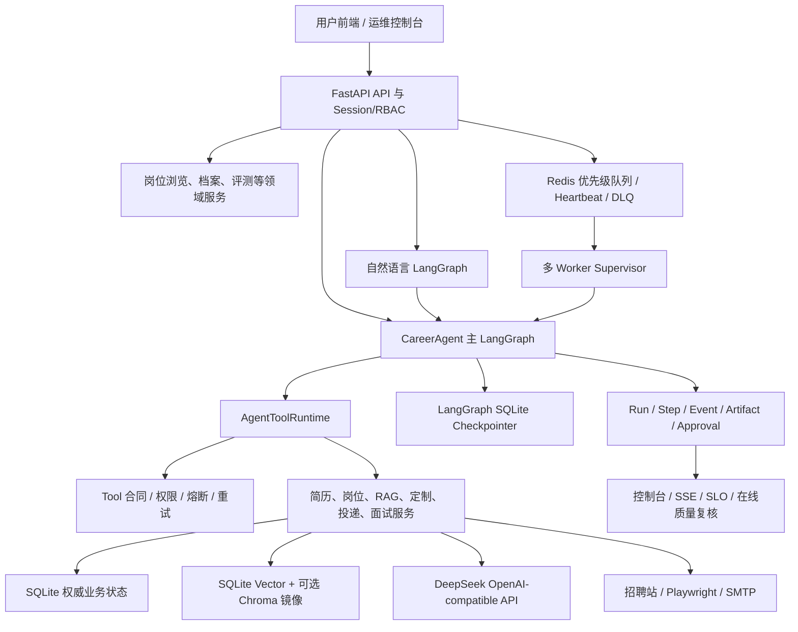

# CareerAgent 完整系统设计、评测与 Bad Case 治理

> 文档状态：当前实现权威总览  
> 核对时间：2026-08-12  
> 适用场景：项目理解、架构评审、开发交接、简历项目介绍和面试深挖

## 1. 项目定位与结论边界

CareerAgent 是面向中文 Agent、LLM 应用和 RAG 岗位的求职 Agent。它不是“把简历和 JD 放进一个 Prompt”的演示，而是一个包含真实数据接入、结构化解析、混合检索、多步工作流、人工审批、崩溃恢复、审计、评测和运维控制面的完整系统。

系统主要解决五类用户任务：

1. 用户没有简历时，根据岗位偏好浏览真实招聘源和系统岗位库。
2. 用户上传 PDF、输入自然语言或手动填写信息后，建立可预览、可检索的简历档案。
3. 根据简历与求职偏好检索岗位，解释匹配证据与能力缺口。
4. 基于目标 JD 和候选人真实经历生成定制简历、投递材料和面试准备包。
5. 对外发邮件、浏览器投递等高风险动作执行人工审批、幂等和审计。

当前系统已经具备工程级 Agent 的主要控制面，但不能把它描述为已经经过大规模生产用户验证的平台：

- 已有完整的本地产品界面、FastAPI API、LangGraph 主图、Redis worker、SQLite 权威存储、真实 embedding、RAG、审批、Trace、SLO 和评测体系。
- 当前全量代码回归为 `309 passed`，并有多类真实模型和真实数据源评测。
- 真实用户 7/30 天流量尚未形成，因此线上任务成功率、用户满意度、真实投递转化率和录用提升没有统计资格。
- 2026-07-22 的严格整轮 Agent 系统发布门禁曾失败；之后完成了多轮修复和定向回归，但不能用局部回归覆盖历史失败结论。

## 2. 当前系统规模

以下数字由 2026-08-12 当前源码扫描得到：

| 项目 | 数量 | 说明 |
| --- | ---: | --- |
| FastAPI HTTP route | 126 | 包含用户 API、运维、评测、治理和前端页面 |
| SQLAlchemy 表 | 29 | 业务数据、Agent Trace、审批、评测、租户、SLO 等 |
| Agent Tool | 18 | 均有输入输出合同、风险、审批、超时、重试和幂等策略 |
| Agent Skill | 7 | 文件化 `SKILL.md`，按任务渐进披露 |
| SubAgent 职责边界 | 7 | 不是 7 个自由自治模型，而是明确的上下文与责任域 |
| 主 LangGraph 节点 | 18 | 覆盖 5 类核心任务、interrupt 和 Completion Gate |
| 自然语言 Agent 节点 | 8 | 解析、执行、校验、一次修复和显式终态 |
| 面试 Agentic RAG 节点 | 7 | 检索规划、检索、生成、验证、修复、完成和失败 |

## 3. 用户视角的三种使用模式

### 3.1 只搜索岗位

```text
岗位偏好
-> 真实招聘源/本地岗位库
-> JD 结构化与 Prompt Injection 检测
-> 岗位混合检索与重排
-> 岗位列表和 JD 详情
```

这个模式不要求简历。系统只展示岗位与用户偏好的相关度，不伪装成候选人匹配分。

### 3.2 只提供简历

```text
PDF/自然语言/手动档案
-> Profile 结构化
-> Resume Chunk 与向量索引
-> 从简历目标岗位、技能和城市构造查询
-> 岗位检索
-> 简历证据匹配与差距分析
```

### 3.3 同时提供简历和岗位偏好

用户显式偏好优先，简历用于补充检索词和匹配证据。岗位详情页可以继续触发：

```text
选择岗位
-> JD 结构化
-> 从简历经历库检索证据
-> 匹配与差距分析
-> 定制简历
-> 用户确认
-> 投递包/外发工具
-> 面试准备
```

## 4. 总体架构



### 4.1 分层与依赖方向

| 层 | 职责 | 不承担的职责 |
| --- | --- | --- |
| `frontend/templates/static` | 用户交互、进度恢复、预览、控制台 | 不实现业务门禁 |
| `api` | 协议、鉴权、Pydantic 校验、Session 注入 | 不复制 RAG 或审批规则 |
| `agents` | LangGraph 状态、路由、interrupt、任务规划 | 不直接拼 SQL 或操作浏览器 |
| `skills` | 能力契约、允许工具、上下文和失败策略 | 不保存运行状态 |
| `services` | 求职业务规则、RAG、Guardrail、外部适配 | 不依赖 FastAPI Request |
| `models` | SQLAlchemy/Pydantic 数据合同 | 不编排工作流 |
| `core` | 配置、数据库、LLM、Redis、安全、遥测 | 不做岗位匹配决策 |
| `evals/tests` | 质量指标、发布门禁、回归和对抗样本 | 不被生产代码反向依赖 |

```text
Frontend/API -> Agents -> Services -> Models/Core
Skills -> Planner/Tool Policy metadata
Evals/Tests -> API/Agents/Services
```

### 4.2 用户前端与运维控制台

用户前端按求职任务组织，而不是暴露数据库和队列字段：

- 开始页：岗位偏好、简历来源、必做流程和可选产物。
- 简历页：已有档案选择、PDF/自然语言/表单建档、评分、HTML/PDF 预览。
- 岗位页：无简历浏览、有简历匹配、JD 详情和继续定制入口。
- 定制简历页：二级选择 Profile/Job，正文预览和独立检查结果。
- 投递页：材料状态、审批、外发结果和不可逆边界。
- 面试页：准备重点、直接参考答案、来源、练习进度和导出。
- 历史记录：最近 50 条 run、持久化进度、事件、checkpoint 分支和撤回。

控制台单独承载 Redis queue/DLQ、stale run、approval、circuit breaker、SLO、LLM Token、评测和运维审计，避免把后台数据混入用户页面。

### 4.3 29 张数据表的领域划分

| 领域 | 表 |
| --- | --- |
| 身份与租户 | `tenants`、`app_users` |
| 简历与岗位 | `profiles`、`resume_chunks`、`jobs`、`job_chunks` |
| 搜索与匹配 | `job_search_sessions`、`job_search_results`、`match_results` |
| 业务产物 | `resume_versions`、`applications`、`interview_preps`、`interview_practice_items`、`interview_experiences` |
| Agent 可观测状态 | `agent_runs`、`agent_steps`、`agent_events`、`agent_artifacts` |
| 治理与控制 | `agent_approvals`、`agent_run_control_actions`、`tool_circuit_states`、`ops_audit_events` |
| 记忆与反馈 | `agent_memories`、`agent_feedback`、`agent_quality_reviews` |
| 任务与模型 | `task_runs`、`llm_call_logs` |
| 评测与 SLO | `evaluation_runs`、`http_request_metrics` |

LangGraph checkpoint 使用独立 SQLite 文件，不和业务表混在同一 ORM schema；checkpoint 负责执行位置，业务表负责事实与副作用。

## 5. Agent 核心设计

### 5.1 为什么使用 LangGraph

CareerAgent 的任务包含长流程、多种终态、人工确认、崩溃恢复和外部副作用，单次函数调用或纯 ReAct 循环难以稳定表达这些约束。LangGraph 在本项目中主要用于：

- 用显式状态图表达可执行步骤和条件边。
- 用 checkpoint 支持进程崩溃后的继续执行。
- 用 `interrupt` 实现岗位选择和投递前人工确认。
- 用事件流输出节点级进度。
- 用独立 thread 支持历史 checkpoint 分支，而不篡改原运行。
- 把 Completion Gate 放在所有成功终点之前，避免提前结束。

主图的 18 个节点包括：计划、加载 Profile、岗位搜索、批量匹配、人工选岗、加载 JD、单岗匹配、简历定制、Fit Gate、确保简历版本、生成投递包、生成面试包、五类业务 finalize 和统一 Completion Gate。

### 5.2 五类核心任务

| 任务 | 主要结果 | 关键控制 |
| --- | --- | --- |
| `find_jobs_for_profile` | 排序岗位和 MatchResult | source error、RAG quality、空结果显式失败 |
| `tailor_resume_for_job` | ResumeVersion | 证据门禁、上下文预算、Guardrail、一次 repair |
| `quick_apply` | Application/投递包 | Fit Gate、interrupt、审批、事实校验 |
| `prepare_interview_for_job` | InterviewPrep | 多源 RAG、claim verifier、质量发布门禁 |
| `full_career_flow` | 统一求职包 | 人工选岗、产物 lineage、投递确认、Completion Gate |

### 5.3 Plan-Execute 与有限 ReAct

系统没有把所有任务都做成无限 ReAct：

- 主业务流程使用 Plan-Execute。Planner 生成步骤、Skill、SubAgent、Tool Policy 和上下文策略，图按确定性条件边执行。
- ReAct 只用于可以安全修复的局部闭环，例如“生成定制简历 -> Guardrail 观察问题 -> 修复一次 -> 再验证”。
- 基础设施错误、预算耗尽、配置缺失、熔断和不可重试错误不进入 LLM repair。
- Repair 次数、总 Tool 步骤、重复调用和 LLM Token 都有上限。

### 5.4 Skill 的渐进式披露

当前 7 个 Skill：`resume_intake_and_structuring`、`jd_structuring`、`evidence_retrieval`、`fit_assessment`、`resume_tailoring`、`application_packet`、`interview_preparation`。

每个 Skill 文件声明触发条件、输入、允许工具、上下文策略、输出合同、禁止行为和失败策略。Planner 默认只读取 Skill metadata 和当前任务需要的精简合同；只有真正进入能力节点时才加载详细说明，避免把全部 Skill 文本塞入每次 Prompt。

### 5.5 SubAgent 的真实含义

当前 `profile_analyst`、`job_analyst`、`evidence_curator`、`fit_judge`、`resume_writer`、`application_operator` 和 `interview_coach` 是责任与上下文边界，不是为了展示 Multi-Agent 而创建的七个独立进程。

它们用于隔离读写范围、缩短 Prompt、校验 Tool 权限，并保留将来拆服务的边界。上下文压缩不作为独立 SubAgent，因为它是每次 LLM 调用前的确定性 runtime policy，不需要另一次模型调用。

### 5.6 Tool Runtime

18 个 Tool 均注册在统一目录中。每个 Tool 声明输入输出 schema、外部副作用、风险等级、审批、幂等、timeout、retry policy、唯一 `retry_owner`、审计事件和允许调用它的 Skill。

| 类别 | Tool |
| --- | --- |
| 编排 | `LangGraph.AgentPlanner`、`llm.intent_planner`、`NaturalLanguageAgentService` |
| Profile/Job | `profile_repository.load_profile`、`job_search.search_jobs`、`job_repository.load_job`、`jd_parser.parse_jd` |
| RAG/匹配 | `vector_index.upsert_job_chunks`、`vector_index.retrieve_resume_evidence`、`matcher.match_job` |
| 简历与校验 | `resume_tailor.tailor_resume`、`guardrail.verify_resume` |
| 投递与面试 | `application.create_quick_apply_packet`、`interview_prep.generate_packet`、`interview_experience.import_text` |
| 高风险外发 | `browser_apply`、`email_draft`、`email_send` |

```text
Tool permission
-> input contract
-> persistent circuit breaker
-> timeout/retry policy
-> handler
-> output contract
-> Trace/Event
-> ErrorEnvelope 或业务结果
```

未知 Tool、错误参数、非法输出和越权调用在运行层失败，不交给 LLM 猜测修复。

### 5.7 Task Contract 与 Completion Gate

“图走到 END”不等于任务完成。系统在成功终点前检查：请求动作对应 Artifact、Tool 选择/顺序/参数、重复与无进展、SQLite 产物存在性、跨产物 lineage、审批、岗位选择范围和产物 lifecycle。失败时进入显式失败终态并保留完整 Trace，而不是用一句模糊回复提前结束。

## 6. 简历模块

### 6.1 建档入口

系统支持选择已有档案、上传 PDF 自动建档、自然语言或多段表单建档。结构化 Profile 支持多段教育、项目、实习/工作经历、技能、奖项、证书、校园经历、个人总结和可选照片，并可用 HTML/PDF 预览。

### 6.2 PDF 解析与 Chunk

```text
PDF 提取
-> 页码与段落保留
-> Profile 结构化
-> 结构字段 Chunk
-> 页级段落 Chunk
-> Raw Text Chunk
-> embedding 与 metadata 入库
```

当前选中 `paragraph_page_900_overlap160`。Chunk 保存 `chunk_uid`、类型、来源、页码、token count、结构字段路径和 embedding/retrieval metadata。

### 6.3 简历评分与定制

评分覆盖完整性、岗位聚焦、证据强度、技术深度、量化结果、表达清晰度和 ATS 友好度。建议独立展示，不写入简历正文。

定制链路：

```text
Profile + JD
-> Matcher 多查询检索
-> Evidence Gate
-> ContextCompressor
-> Flash 生成草稿
-> Resume Guardrail
-> 高风险时一次 ReAct repair
-> ResumeVersion + diff + verification
```

模型可以重排、压缩和强调已有事实，但不能新增学校、公司、日期、指标、技能或项目成果。检查结果、能力缺口和修改摘要保存在独立字段中。

## 7. 岗位模块与 JD RAG

### 7.1 岗位来源

默认中文主链路接入腾讯、百度、美团、字节跳动和阿里巴巴招聘站。多来源并发，单个来源失败只记录 `source_errors_json`；不绕过登录、验证码和反爬；外部 source smoke 与核心 Agent 评测分离。

### 7.2 JD 结构化

JD 被解析为职位、公司、城市、类型、职责、任职要求、required/preferred skills、关键词、原文和链接。系统区分硬要求与加分项，规范化中英文岗位类型，分开检索扩展词与事实字段，并检测外部文本中的 Prompt Injection。

### 7.3 岗位发现

1. 城市、实习类型、租户等 metadata filter。
2. 中文岗位规则与词法分缩小候选池。
3. 查询候选岗位 `job_chunks` 得到语义分。
4. 规则、向量和类型分融合。
5. 岗位级 Top20 rerank。
6. 有简历时运行 Matcher；无简历时只显示岗位相关度。

每次搜索建立 `job_search_sessions/job_search_results`，页面刷新后可按 session 恢复。

## 8. RAG 与证据治理

### 8.1 索引选型

系统采用“SQLite 权威状态 + 可选 Chroma 镜像”：SQLite 保存 chunk、metadata、embedding 和业务关联；Chroma 只在 hybrid 模式提供向量镜像。生产 embedding 为 `sentence-transformers/paraphrase-multilingual-MiniLM-L12-v2`，pytest 的 hash provider 只用于显式离线测试。

当前规模不需要一开始引入 Milvus/Elasticsearch。规模增长后可以替换召回引擎，但业务事实与引用关系仍由关系数据库保存。

### 8.2 混合检索与重排

```text
first_stage = 0.45 * vector + 0.50 * lexical + 0.05 * type_boost
```

技术词需要精确匹配，中英同义职责需要语义匹配，因此 BM25 与向量互补。Profile 使用 semantic-field multi-query，经 RRF 融合后只 rerank 一次。

默认 rerank Top20，Top5 是 recall anchor。默认 MS MARCO CrossEncoder 偏英文，中文 query 走 CJK lexical route。多语言 mMARCO 候选在本机 CPU 对 1,440 对耗时超过 10 分钟，未进入默认路由。

### 8.3 EvidenceClassifier 与 Gate

证据类型包括 shipped project、metric evidence、generic skill、adjacent experience、coursework、planned learning、missing disclosure 和 mixed delivery/disclosure；polarity 包括 positive、neutral、weak、negative、mixed。

真实多语言 embedding 的 Evidence Gate v3：

```text
vector >= 0.50
OR
(lexical/query coverage >= 0.10 AND first_stage >= 0.45)
```

事实敏感生成还要求证据类型可作为支持。阈值绑定 provider，hash 测试阈值不能降低生产门禁。

检索相关性、候选人事实支持和最终 claim 校验是三个不同层次，分别由 Retrieval、EvidenceClassifier 和 Guardrail 负责。

## 9. 匹配与差距分析

Matcher 综合 required skill coverage、语义相似度、项目证据、岗位类型、preferred skill 和负向证据惩罚，输出 overall score、维度分、matched/missing skills、Top evidence 和检索质量。

- `strong_fit`：核心要求大多有真实交付证据。
- `partial_fit`：有直接或相邻交付，但仍有重要缺口。
- `weak_fit`：主要是课程、阅读、计划学习、意向或相邻经验，缺核心交付。

目标岗位、headline 和技能列表不能单独证明交付。Fit Gate 会阻止低匹配 quick apply，但不阻止用户浏览岗位和查看差距。

## 10. 投递、审批与外发

投递包包含简历引用、求职信、外联文案、清单、链接和确认状态。Guardrail 检查技能、经历、数字、目标岗位、缺口披露和“是否已投递”的事实边界。

`browser_apply`、`email_draft`、`email_send` 强制绑定 `agent_approvals`：审批后由 HighRiskActionToolService 校验并幂等执行，结果写 Artifact 和 Ops Audit。外发工具即使遇到可重试网络错误也不自动重放，因为 retryable 不等于 replay-safe。

## 11. 面试 Agentic RAG

面试内容来自同岗面经/链接、简历项目和技术栈、JD 必备技能与缺口三类来源。


正常路径固定 3 次 LLM 调用，repair 最多 5 次。JD 不能证明候选人做过，面经不能证明公司固定题库，技术知识不能证明候选人经历。最终答案由已验证 claims 本地组合，提供可直接参考的回答正文。

## 12. 上下文、记忆与模型路由

### 12.1 渐进式压缩

可见层是 Profile facts、Job requirements、Ranked evidence，再加 Prompt packet 总预算。完整原文和非 Top evidence 延迟披露。每层记录输入/输出字符、预算、压缩事件和保留证据数。

这不是六级压缩，也没有 `context_manager` SubAgent；上下文治理是确定性 runtime policy。证据不足时报告缺口，不继续摘要制造信息。

### 12.2 状态与 Memory

| 状态 | 用途 | 存储 |
| --- | --- | --- |
| Checkpoint | 当前 run 执行位置 | LangGraph SQLite saver |
| Artifact/业务表 | 已验证事实和产物 | SQLite |
| Typed memory | 跨 run 偏好、限制、决定、结果、纠错 | `agent_memories` |

长期记忆按 tenant/user/profile 隔离，不保存无限聊天全文，模型自由文本不能自动升级为事实。

### 12.3 模型路由

| 路由 | 节点 | 模型 | 依据 |
| --- | --- | --- | --- |
| `flash_economy` | 规划、解析、fit、定制、投递文案 | `deepseek-v4-flash` | 短结构化任务成本和并发更优 |
| `pro_quality` | 深度简历建议、面试生成与验证 | `deepseek-v4-pro` | 多约束质量更稳定 |
| `configured_default` | 尚未分类 trace | `LLM_MODEL` | 先暴露，再归类 |

路由不是 fallback。Flash 失败不会静默切 Pro。父子图共享 LLM 总预算，日志记录实际模型、route、prompt hash、usage、延迟和错误。

## 13. 并发、队列与恢复

FastAPI 并发多招聘源请求、多 JD 无状态解析和外部 I/O；同一同步 SQLAlchemy Session 的写入、有业务依赖的节点和外发副作用保持串行。

长任务进入 Redis 优先级队列，由多 Worker Supervisor 消费。系统具备 run lock、分阶段 heartbeat、queued/stale recovery、DLQ、人工重放/丢弃、健康探针、优雅 drain 和 Sentinel/HA 配置入口。SQLite 是业务权威状态，Redis 是调度协调层。

三种运行控制语义分离：

- Crash recovery：原 thread 最新 checkpoint 继续。
- Checkpoint rewind：创建新 run/new thread，不改原时间线。
- Business withdrawal：软撤回内部产物和待审批动作，不删除共享事实与审计。

业务写节点使用唯一幂等键处理“业务 commit 后、checkpoint commit 前”的崩溃窗口。

## 14. 可观测性、安全与 SLO

一次运行保存 Run、Step、Event、Artifact、Approval、LLMCallLog 和 business summary。SSE 支持刷新后重放历史事件并继续订阅。

安全控制包括 Session/RBAC、tenant/user scope、Prompt Injection 检测、Tool allowlist、Skill permission、高风险审批、秘密/PII 脱敏和运维审计。

| SLI | 目标 | 最小样本 |
| --- | ---: | ---: |
| 用户 API 非 5xx 比例 | >= 99.5% | 50 |
| 用户 API P95 | <= 1,500ms | 50 |
| Agent 有效终态率 | >= 95% | 20 |
| Agent P95 | <= 180,000ms | 20 |
| Completion Gate 完整率 | 100% | 20 |

真实与合成流量分开计算 7/30 天窗口、Wilson 下界和误差预算，合成探针不能冒充线上 SLO。

## 15. 评测体系与数据规模

评测分为解析/Chunk、检索/重排、LLM 节点、Tool 轨迹、数据库终态、可靠性、安全、性能成本和 SLO。安全项采用硬门禁，不提供掩盖越权或编造的加权总分。

| 数据集 | 规模 | 覆盖 |
| --- | ---: | --- |
| PDF Chunk | 96 份、576 query | 多页、课程/项目混淆、跨页、长附录 |
| RAG 主集 | 180 case、2,160 chunk | 12 类岗位、4 档难度、hard negative |
| 多语言 RAG | 144 case、1,440 pair | 中英同概念、跨语言、混写、9 负例/case |
| JD Parser | 30 | required/preferred、否定要求、中英别名 |
| 自然语言规划 | 20 | 多动作、显式禁止、部分表单、中英混合 |
| LLM Workflow | 24 | Profile/JD/RAG/fit/tailor |
| Agent Full Flow | 6 | 搜索、匹配、定制、投递阻断、Trace |
| 岗位相关性 | 13 query、130 岗位 | 0-4 级相关性 |
| 投递 Guardrail | 27 | 技能、经历、数字、跨语言、外发边界 |
| Prompt Injection | 70 | benign、注入、混淆、多来源 |
| 面试准备 | 9 | 面经、项目、JD、缺口和来源覆盖 |
| Claim Verifier | 14 | 支持、不支持、伪装经历、答非所问 |

## 16. 现有量化结果

### 16.1 确定性回归

2026-08-11 当前代码：`309 passed in 97.99s`。这证明控制面和固定数据回归，不代表真实模型或线上用户成功率为 100%。

### 16.2 PDF Chunk

选中 `paragraph_page_900_overlap160`：

| 指标 | 结果 | 门禁 |
| --- | ---: | ---: |
| Top3 keyword hit | 0.9479 | >= 0.90 |
| Top3 page hit | 0.8299 | >= 0.80 |
| Top3 context hit | 0.7760 | >= 0.75 |
| Top1 平均字符 | 772.77 | <= 950 |
| 平均 Chunk 数 | 10.00 | <= 14 |

弱点：`coursework_vs_shipped` Top3 context hit 仅 `0.0521`，所以需要 EvidenceClassifier，不能只靠切块。

### 16.3 180-case RAG

| 指标 | 结果 | 门禁 |
| --- | ---: | ---: |
| Top1 | 1.0000 | >= 0.80 |
| Recall@3 | 0.6125 | >= 0.60 |
| Recall@5 | 0.7292 | >= 0.70 |
| MRR | 1.0000 | >= 0.85 |
| nDCG@5 | 0.7862 | >= 0.75 |

每个 query 最多有 4 个 gold，Recall@3 理论上限为 0.75。Top1 满分不代表长尾证据全部召回。

### 16.4 多语言 RAG 与 Evidence Gate

| 策略 | Top1 | Recall@5 | MRR |
| --- | ---: | ---: | ---: |
| 多语言纯向量 | 0.9792 | 1.0000 | 0.9896 |
| 生产混合一阶段 | 0.9722 | 1.0000 | 0.9850 |
| 混合 + Top20 rerank | 0.9722 | 1.0000 | 0.9850 |

中文查英文 Top1 `0.9167`，英文查中文 `1.0000`；两者 Recall@5 均为 1.0。

| Gate | Recall | Precision | F1 | FPR |
| --- | ---: | ---: | ---: | ---: |
| 旧门禁 | 1.0000 | 0.1026 | 0.1862 | 0.9715 |
| Evidence Gate v3 | 0.9583 | 0.8519 | 0.9020 | 0.0185 |

### 16.5 其他组件

| Suite | 结果 | 口径 |
| --- | --- | --- |
| 中文岗位相关性 | 13 case；Top1/Recall@3/5/MRR=1.0，nDCG@5=0.9495 | 固定离线集 |
| 投递 Guardrail | 27 case，pass=1.0 | 固定离线集 |
| Prompt Injection | 70 case，recall=1.0，FPR=0 | 固定对抗集 |
| Agent Full Flow | 6 case 当前隔离回归 pass/trace/artifact/LangGraph=1.0 | hash/fake LLM 控制面 |
| 面试包 | 9 case，各核心 pass rate=1.0 | 确定性 fixture |
| Claim Verifier | 14 case，accuracy/recall/specificity=1.0，FPR=0 | 真实 DeepSeek 门禁 |

JD Parser 必须带模式：真实 LLM 30-case 曾达到 pass/grounding=1.0；较新的 heuristic fallback 运行 pass=0.9333、grounding=0.9333，release gate 失败。不能挑一个代表所有运行模式。

### 16.6 真实 LLM 历史与边界

2026-07-22 整轮真实 Agent 系统评测：自然语言规划 20 case `pass=0.85`；LLM Workflow 24 case `E2E=0.75`；Agent Full Flow 6 case `pass=0.8333`；稳定性 3 case × 2 为 `pass@1=pass^2=0.6667`，严格发布门禁失败。

后续修复了多动作执行、跨语言证据、Grounding、Completion Gate 和 RAG 门禁并做定向回归，但没有用局部复测改写整轮历史结果。

历史 Pro 18-case 全量基线曾达到 E2E/fit/tailor/guardrail=1.0。它早于部分重构，只能作为历史趋势，不是当前 24-case 发布认证。

### 16.7 性能、成本和 SLO

2026-07-22 剔除评测器重复进程后的真实模型指标：171 次调用、成功率 99.42%、218,342 tokens、估算 0.257601 元；LLM latency P50 3.538s、P95 9.684s、max 34.788s。

2026-08-11 合成 SLO：API 375/375、P95 110.457ms；Agent 67/69、P95 54.917s；Completion integrity 67/67。真实流量仍为 `insufficient_data`。

## 17. Bad Case 治理

### 17.1 RAG、排序与证据

| Bad Case | 根因 | 处理方案 |
| --- | --- | --- |
| Recall=100% 但负例几乎全通过 | 只评正例召回 | 增加 1,296 负 pair，把 Precision/FPR 和分语言 Recall 加入门禁 |
| Reranker 让 Top1 下降 | 英文模型/启发式越过一阶段头部 | Top5 anchor、promotion gap、语言路由，二阶段必须证明不退化 |
| 相关内容不能支持 claim | embedding 相关性不等于蕴含 | Retrieval、evidence polarity、claim guardrail 三层分离 |
| 岗位浏览被简历事实门禁拒绝 | metadata 缺失且两类门禁混用 | 保存 vector/lexical/first-stage；浏览验 JD，生成验个人证据 |
| 混合正负经历整段丢失 | 一见否定词就判 negative | `mixed_delivery_disclosure` 同时保留交付和边界 |
| “没有实现”命中“实现” | 裸 substring 无否定作用域 | 先移除完整否定动作，再识别独立交付 |
| `without new artifacts` 被判缺能力 | `without` 缺语境 | 单独识别无进展运行短语并回归 |
| 真实阈值套到 hash | 不同 provider 分布不同 | Provider-aware threshold，生产门禁禁止 hash |
| 超长 query 稀释意图 | 多字段互相干扰 | semantic-field multi-query + RRF + single rerank |
| 极短简历被证据数量误伤 | 文档长度被当质量 | 最少一条，但必须满足相关性和类型门禁 |

### 17.2 LLM 解析、判断与生成

| Bad Case | 根因 | 处理方案 |
| --- | --- | --- |
| LLM 返回 null 导致 schema 失败 | 缺失表达不统一 | 可空字符串/列表规范化为空值，不生成事实 |
| 加分项/否定项进入 required | 结构边界不清 | required/preferred 分离，absent-required 硬门禁 |
| 检索扩展词被当 JD 事实 | keyword 与事实共用 grounding | 扩展词单列，事实字段严格校验 |
| 正确的“缺证据”结论无法直接 citation | 用正向算法验证负向 gap | 先验 JD 要求，再验证交付证据不存在 |
| 后一句否定污染前一句 | 英文句界不足 | 句号+空格切句，否定只作用本句 |
| 跨语言改写被词法拒绝 | 词面重合低 | 多语言 embedding + 否定极性/结果语义一致 |
| 高相似句夹带新结果 | 前半句拉高 embedding | outcome semantic group 单独对齐 |
| 缺口被写成“计划学习”进入简历 | 模型积极包装 | 缺口只进 notes；高风险一次 repair |
| 面试只有机械回答框架 | 旧流程未生成正文 | verified claims 本地组合直接可参考答案 |
| 批量 verifier JSON 截断 | 沿用旧 completion 上限 | 10 题上限重算，漏题只重试漏项 |

### 17.3 Agent、Tool 与完成语义

| Bad Case | 根因 | 处理方案 |
| --- | --- | --- |
| 建档后提前 return，漏执行搜索 | 只评计划 JSON | Completion Gate 验 required actions，repair 只补缺项 |
| Tool success 不等于任务正确 | 只统计函数状态 | 检查选择、参数、顺序、冗余和 outcome |
| 空岗位结果仍 completed | END 被当成功 | Task Contract 要求非空业务结果 |
| 变化输入但输出不变的循环 | 只比较完整 input | step family 无进展检测 |
| match 与 fit gate 被误判循环 | 共用同 Tool | tool + step family 区分 |
| State 有 ID 但 DB 无产物 | 过度信任 checkpoint | Completion Gate 回查实体和 lifecycle |
| 跨岗位产物串线 | 只看字段非空 | profile/job/resume lineage 全链路校验 |
| Repair 重跑已完成副作用 | 修复计划未继承结果 | 复用 Artifact，只执行缺失动作 |
| Fit Gate 合法阻断被算异常 | failed step 一刀切 | expected policy block，且禁止后续外发 |
| lambda 返回函数对象 | 条件优先级隐藏类型 | 显式 handler 分支 + Runtime 合同 |
| literal enum 被当 ORM 类 | 类型约定不清 | 大写实体、小写 literal enum |

### 17.4 持久化、队列与恢复

| Bad Case | 根因 | 处理方案 |
| --- | --- | --- |
| 第 19 次 checkpoint SQLite lock | 缺 WAL/busy timeout | WAL、30s busy timeout、NORMAL synchronous |
| 业务 commit 后 checkpoint 前崩溃重放 | checkpoint 不代表副作用状态 | 首次写入即使用业务幂等键和唯一索引 |
| 只看 Redis lock 判断死亡 | lock/heartbeat 都可能失真 | heartbeat + lock + SQLite stale time 联合判断 |
| running run 不能恢复 | scanner 只覆盖 queued | 从原 thread 最新 checkpoint 继续 |
| 历史回溯覆盖原时间线 | 同 thread 改状态 | fork 新 run/new thread/new idempotency scope |
| UUIDv4 checkpoint 排序错误 | saver 依赖可排序 ID | LangGraph `uuid6()` |
| 恢复成功仍被旧失败污染 | 所有 attempt 都算当前 | 相同签名以最后 attempt 判当前，历史保留 |
| Fork 有状态无轨迹前缀 | 新 run 看似跳步 | inherited trajectory Artifact，不伪造 Step |
| poison message 重试三次 | worker 不识别不可重试 | ErrorEnvelope.retryable=false 直接 DLQ |
| Shell 超时子进程继续 | Windows 未级联终止 | invocation ID/进程审计，CI 用进程组或容器 |

### 17.5 安全、多租户与评测器

| Bad Case | 根因 | 处理方案 |
| --- | --- | --- |
| 外发网络错误自动重试 | retryable 与 replay-safe 混淆 | browser/email 单次执行，人工决定重试 |
| Tool Policy 只展示不执行 | Trace 直接 await handler | 全部进入 AgentToolRuntime |
| 未注册 demo Tool 被测试要求放行 | fixture 固化不安全入口 | 修改 fixture，不关闭 strict registry |
| 同租户用户记忆串线 | 只按 tenant/profile | tenant + user + profile scope |
| 顶层 owner 未透传子图 | 调用签名缺身份 | ContextVar/签名感知透传 |
| 日志脱敏清空 Token 指标 | 字段名含 token 即判秘密 | 精确 secret key；usage 与 PII 分离 |
| 撤回等于删除 | 忽视审计和不可逆动作 | 软撤回，审计保留，已发送不可撤回 |
| SLO 探针分母错误 | 混入依赖未就绪任务 | diagnostic/synthetic/real 分离 |
| 最终成功掩盖调用失败 | retry 后只报 case 完成 | 同时报 case 与调用级成功率 |
| 评测进程重叠重复 Token | shell 超时子进程仍运行 | invocation ID、时间窗、trace 去重 |
| 稳定失败被当随机波动 | 只运行一次 | `pass^k`，系统性失败先修再重跑 |
| 为门禁变绿直接改标注 | gold disagreement 未治理 | 保留旧标注、双人复标、记录争议 |
| 生成集语言正例错位 | 只校验 JSON 数量 | 语言/概念/正例 invariant 测试 |
| 不同模式同名指标混用 | provider/数据范围不同 | 每个数字绑定 run、provider 和 gate |
| 后端正确但前端空白 | 浏览器缓存旧 JS | cache-busting、DOM 契约、浏览器回归 |

## 18. MCP、成熟度与下一步

核心 Profile/JD/RAG 位于同一事务域，直接 Python Tool 更容易类型检查、事务和审计；强制 MCP 化不会自动提升成熟度。适合 MCP 的边界是浏览器登录态、邮箱、日历、云盘和需账号招聘平台。未来 MCP adapter 仍必须继承 approval、tenant scope、idempotency 和 audit。

当前已具备现代 Agent 的主要工程特征：LangGraph、checkpoint/interrupt、Tool runtime、RAG 三层门禁、Completion Gate、Redis/DLQ、审批/幂等/审计、多租户、长期记忆和分层评测。

仍需验证：真实用户 7/30 天 SLO、更大真实中文简历/JD 标注集、中文查英文排序、多语言 reranker 延迟、当前版本 24-case 真实 LLM 全量、至少 10 case × 3 的 `pass^k`、真实投递/面试/录用 outcome，以及高写入时 PostgreSQL/专业观测迁移。

准确表述是：

> CareerAgent 已经是一个具备现代 Agent 控制面和完整用户流程的工程化候选产品，并拥有可复现评测与多类 Bad Case 治理；当前仍处于受控上线和真实流量校准阶段，不能宣称已经经过大规模生产验证。

## 19. 复现与专题文档

```powershell
python -m pytest -q
python -m scripts.generate_multilingual_rag_calibration
python -m scripts.run_multilingual_rag_calibration
python -m scripts.run_slo_probes
python -m scripts.run_llm_workflow_eval
python -m scripts.run_agent_worker_supervisor
```

- [架构设计](ARCHITECTURE.md)
- [Agent Runtime 可靠性](AGENT_RUNTIME_RELIABILITY.md)
- [评测方案与历史结果](EVALUATION.md)
- [PDF Chunk 设计](PDF_CHUNKING.md)
- [多语言 RAG 校准](RAG_MULTILINGUAL_CALIBRATION.md)
- [SLO 与误差预算](SLO.md)
- [Redis + SQLite 架构](CAREER_AGENT_REDIS_SQLITE_ARCHITECTURE.md)
- [项目目录](PROJECT_STRUCTURE.md)
- [倒序开发日志](DEVELOPMENT_LOG.md)
