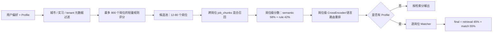
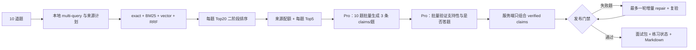

# CareerAgent 核心链路实现详解

## 1. 从输入到产物的完整数据流

用户的一次完整操作可以拆成五类数据：

1. **意图数据**：自然语言需求、目标岗位、城市、实习/校招和用户显式勾选项。
2. **候选人事实**：PDF 原文、结构化 Profile、字段 chunk、页级 chunk 和 embedding。
3. **岗位事实**：真实招聘源返回的 JD、结构化要求、字段 chunk、原文 chunk 和投递链接。
4. **中间判断**：检索证据、匹配维度、缺口、Guardrail、claim verifier 和审批状态。
5. **交付产物**：岗位结果、定制简历、投递包、面试包、业务摘要和可恢复的 Agent run。

关键设计是让每一步都把结构化中间结果落库。后续出现错误时，可以判断问题来自解析、召回、重排、上下文压缩、模型生成还是发布门禁，而不是只看到一段最终文本。

## 2. 自然语言入口：LLM 规划，但代码决定权限和执行

`NaturalLanguageAgentService` 自己也是一张 LangGraph 子图：

```text
parse_user_request
-> execute_user_plan
-> 失败时 repair_user_plan
-> execute_repaired_user_plan
-> finalize_success / finalize_failed
```

LLM 把用户描述转成受控的 `intent`、`actions`、`profile_patch`、岗位 query 和资源 ID。代码随后做三层约束：

- 用户在 UI 显式选择或禁止的动作优先于模型推断；
- action 必须来自注册工具，并通过当前 Skill 的 `allowed_tools`；
- 多动作计划按依赖连续执行，不能因为第一个动作是“建档”就在建档后提前结束。

失败最多触发一次 plan repair。repair 的作用是修复缺失字段或动作依赖，不是让模型自由改变用户意图。第二次仍失败就返回 `failed + run_id + trace`。

## 3. PDF 简历解析与 Chunk

### 3.1 解析流程

1. 上传文件保存到 `data/uploads`，文件名经过安全清洗并加 UUID。
2. `pypdf` 按页提取文本，保留 `page_no`；没有可提取文本时直接报错。
3. `PromptInjectionGuard` 把 PDF 当作不可信输入，检测并移除控制模型或工具的恶意行。
4. Flash 模型按 `ProfileStructured` 生成严格 JSON；未知字段使用 `null` 或空数组，禁止把阅读、课程和计划学习当作已掌握技能。
5. Pydantic 做类型归一；`EvidenceGroundingService` 检查结构化字段能否回指清洗后的原文。
6. 不像职位的 headline、无来源的 target role/skill 等可选字段会被拒绝并记录在 `quality_gate.rejected_optional_fields`；关键字段门禁失败则整个解析失败。
7. Profile、结构化数据和 chunk 一起写入 SQLite，再批量生成 embedding。

### 3.2 为什么不是固定 500 字切分

简历中的项目名、技术栈、指标和动作句经常跨行；PDF 又可能有分页、双栏、页眉和附录。固定长度切分容易把“做了什么”和“结果是什么”分开。当前策略是：

- **结构化字段 chunk**：技能、项目、实习、校园经历、教育、证书等每个条目独立建 chunk；
- **页级原文 chunk**：按 PDF 页保留 `page_no`；
- **段落优先**：在 900 字符预算内合并完整段落；
- **滑窗兜底**：单段超过 900 字符时使用 160 字符 overlap；
- **metadata**：保存字段、条目索引、字符起止、页码、策略、embedding provider/model/dimension。

该方案不是凭经验拍值。96 份带分页、相邻技能、课程/交付混淆、计划学习和跨页干扰的简历，共构造 576 个 query。`paragraph_page_900_overlap160` 的 Top3 关键词命中为 94.79%，页码命中 82.99%，上下文命中 77.60%，平均 Top1 长度 772.77 字符，平均每份 10 个 chunk，全部通过发布阈值。

### 3.3 当前已知弱点

噪声分桶中 `coursework_vs_shipped` 的 Top3 上下文命中只有 5.21%。这说明同一 chunk 同时包含“做过 A”和“只在课程中了解 B”时，chunk 级 evidence type 太粗。当前分类器会保守地把整个 chunk 视作负向或弱证据，降低误投风险，但会损失部分正向事实。下一步应该做句子/facet 级切分和极性绑定，而不是继续增加字符串规则。

## 4. JD 获取、解析和入库

### 4.1 真实岗位源

默认中文主链路接入 15 个适配器、22 个企业官方招聘门户：

- 腾讯：公开职位 JSON；
- 百度：公开 SSR 数据；
- 美团：搜索 JSON + 详情 JSON，并用 semaphore 并发补详情；
- 字节：Playwright 打开官网，让页面生成动态 `_signature`，捕获结构化网络响应，不硬编码签名；
- 阿里：动态发现当前实习批次，再并发搜索批次并读取完整 JD。
- 小米：直接调用官网机会页使用的公开搜索 JSON，列表响应已含完整 JD，无需逐条补详情；
- 创维：从官方根域动态发现当前 HotJob suite，先搜校招候选，再以 Semaphore 限制并发补全详情。

`JobSearchService` 用 `asyncio.gather` 并行执行来源。单一来源失败会写入 `source_errors`，其他来源结果仍可使用；这里的容错只发生在独立数据源之间，不会把解析或模型失败伪装成成功。

### 4.2 两种解析模式

- **搜索列表模式**：`parse_jd_for_search` 使用确定性解析，快速提取技能、职责、要求、关键词和 injection 风险，避免搜索 20 个岗位时串行调用 20 次 LLM。
- **深度使用模式**：用户打开 JD、匹配或定制时，Flash 模型生成结构化 JD，再经过 taxonomy、required/preferred、否定语境和 grounding gate。

JD chunk 不机械按长度切，而是先为 `required_skills`、`preferred_skills`、`responsibilities`、`qualifications`、`keywords` 建字段 chunk，再对原文做段落滑窗。这样查询“任职要求”时可以优先命中高价值字段，同时保留原始上下文用于引用。

### 4.3 真实格式噪声

系统曾遇到“负责……。要求……”写在同一行的 JD。旧 parser 把整行识别为章节标题，又因为没有冒号而提取空内容，最终只留下一个技能。修复不是把测试数据改成规整多行，而是先按中文句号/分号拆分行内章节，并支持无冒号的 `负责/任职要求/Requirements` 前缀。

## 5. 岗位 RAG 与排序

### 5.1 Query 构造

`JobDiscoveryService` 根据输入模式生成 query：

- 有显式偏好时，偏好文本是第一优先级；
- 只有简历时，使用目标岗位、技能和项目技术栈；
- 两者都有时合并，但不会让简历覆盖用户明确填写的城市或岗位方向。

### 5.2 检索与排序流水线



先做轻量 shortlist，是为了避免每次对整个岗位库做昂贵向量和 cross-encoder 计算。跨岗位 chunk 阶段只负责找到每个岗位最相关的证据；随后聚合为岗位分，再做一次岗位级 rerank，避免 chunk 和岗位重复精排。

搜索结果会写入 `job_search_sessions` 和 `job_search_results`，包括输入模式、resolved query、来源错误、rank、retrieval/match/final score 和匹配技能。页面刷新后读取同一 session，而不是重新抓站或丢失结果。

## 6. 简历经历 RAG

### 6.1 一阶段混合召回

查询由岗位标题、required skills、keywords、前四条职责和部分 JD 原文组成。Query 先经过受控同义扩展，然后计算：

```text
first_stage_score
= cosine_similarity * 0.45
+ lexical_overlap * 0.50
+ important_chunk_type_boost * 0.05
```

词法通道负责 FastAPI、Redis、LangGraph 等精确技术词，向量通道负责“智能体研发/Agent 开发”“检索增强/RAG”等语义表达，类型 boost 提升项目、经历和技能字段。

### 6.2 二阶段重排

一阶段取 Top20，默认使用 `cross-encoder/ms-marco-MiniLM-L-6-v2` 计算 query-document 相关性，重排分占最终候选分的 30%。为了防止 reranker 把强精确命中挤掉，Top5 是 recall anchor；后续候选只能在 `promotion_gap` 允许的分数带内提升。

需要诚实说明一个实现边界：该 CrossEncoder 本身偏英文。代码检测到中文 query 时会进入可解释的 CJK lexical rerank 路径；RAG 评测中的 provider 门禁证明固定集使用了真实 cross-encoder，但这不等于所有中文请求都经过真正的多语言 cross-encoder。换成经过中文招聘语料校准的 reranker 是后续优化点。

### 6.3 Evidence Type 与极性

召回分高不代表能证明候选人做过。`EvidenceClassifier` 继续区分：

- `shipped_project`
- `metric_evidence`
- `coursework`
- `planned_learning`
- `missing_skill_disclosure`
- `adjacent_experience`
- `generic_skill`

`metric_evidence` 和 `shipped_project` 加权，课程、计划学习和缺口披露降权；否定证据优先于关键词命中。每条 evidence 保留类型、polarity、first-stage score、rerank score 和 chunk ID。

## 7. 岗位匹配与差距分析

生产 Matcher 是可解释的确定性评分加 RAG 证据，不把最终分数全部交给 LLM：

```text
overall
= required_skill_coverage * 0.38
+ resume_jd_semantic_similarity * 0.24
+ evidence_relevance * 0.22
+ internship_fit * 0.08
+ preferred_skill_coverage * 0.08
- negative_evidence_penalty
```

匹配 required skill 时使用英文 token 边界和技能别名，避免 `Agent` 错误命中 `AgentTrace`。支持文本排除姓名、headline、目标岗位等“意向信息”，否则写一句“目标 Agent 岗位”就会被当作具备 Agent 经验。

系统输出总分、六个维度、已匹配技能、缺失技能、Top evidence 和建议。`quick_apply` 的 fit gate 当前要求总分至少 55；低分岗位可以继续浏览和学习，但不会推进投递包。

真实 LLM workflow 中还用 LLM 判断 `weak/partial/strong`，用于评测语义边界。标签合同为：`weak=0-54`、`partial=55-84`、`strong=85-100`；课程和计划学习不能把人提升到 partial，strong 还要求足够的 required skill 覆盖。只有违反合同才允许一次 repair。

## 8. 定制简历：生成、校验与 ReAct 修复

### 8.1 上下文包

`ContextCompressor` 不把完整 PDF、完整 JD 和所有 chunk 直接塞给模型，而是构造：

- `profile_summary`
- `job_summary`
- Top evidence snippets
- 任务约束和输出 schema

压缩 metadata 记录 raw/initial/compressed chars、reduction ratio、保留证据数、预算和 shrink event。默认只披露摘要和 Top evidence；repair 才增加具体 issue 与必要原文。

### 8.2 初稿合同

Flash 模型只能重排、压缩或改写已证实经历。缺失技能只能进入 `keyword_alignment.missing/notes`，不能在简历正文写成“正在学习”来伪装匹配。定制结果保存 Markdown 正文、HTML 预览、diff、change summary、evidence usage 和 context compression。

检查结果和改动摘要单独展示在前端，不进入简历正文。

### 8.3 一轮 ReAct

```text
Observe：读取 JD、证据和当前简历
Act：生成初稿
Observe：Guardrail 检查数字、技能、成果语义、否定极性和证据
Act：高风险时只修复一次，删除或收缩无证据表达
Observe：再次 Guardrail；仍失败则终止
```

只做一轮是有意设计：无限 repair 会增加成本，还可能在多次改写中引入新事实。每轮风险、issue、工具、修复前后结果都写入 `react_repair` metadata。

## 9. 投递包和人工审批

投递包包括求职信、外联短文、清单、目标链接和关联的定制简历。`ApplicationPacketGuardrail` 检查：

- 首行是否精确指向目标公司和岗位；
- 能力、经历和数字 claim 是否有 Profile/简历证据；
- 是否把缺口或计划包装成经验；
- 是否保留 `manual_confirm_required` 和 `user_confirmed_only`。

LangGraph 在创建投递包前创建 `agent_approvals` pending 记录，并 interrupt。审批记录保存 action type、payload hash、脱敏摘要、申请人、决策人和时间。`browser_apply`、`email_draft`、`email_send` 同样必须绑定 approved approval；工具结果作为 artifact 回写 run。

## 10. 面试 Agentic RAG v3

面试模块不是把 JD 和项目拼进一个大 Prompt，而是单独的 LangGraph RAG 子图：



候选证据来自简历、JD、导入面经、项目文档和技术知识库。每种来源只能支持特定 claim type，例如 JD 能证明岗位要求，但不能证明候选人做过；技术知识能解释原理，但不能证明项目已经使用。

生成器只产出 claims 和 evidence aliases，不直接写最终答案。Verifier 对每条 claim 重新选择最小支持证据，并分别判断：

1. **supported**：证据是否蕴含这句话；
2. **answered**：这些正确事实是否真正回答了当前问题。

这是为了解决“句句都对，但答非所问”的真实 bad case。最终答案由服务端使用 verified claims 确定性组合，保留可引用证据和诚实边界。

当前预算是最多 10 题，正常路径由问题生成、答案共享上下文 Batch 和 Verifier Batch 组成；JSON repair 最多 1 次、答案定向 repair 最多 2 轮，整个面试链业务调用不超过 8、累计 Prompt 不超过 100,000 字符、completion 预留不超过 15,000 token。未配置 LLM 或发布门禁失败时不落库，不生成占位答案。

## 11. 为什么这里既有规则又有 LLM

CareerAgent 的边界不是“规则或者 LLM 二选一”，而是按可验证性分工：

- 数据库约束、权限、审批、幂等、状态转移适合确定性代码；
- PDF/JD 语义抽取、自然语言规划和答案表达适合 LLM；
- 证据召回适合混合 RAG；
- 事实是否发布由 grounding、schema 和 verifier 决定；
- 评测标准使用版本化 rubric，不能让模型自己决定自己是否正确。

真正要避免的不是规则，而是把随意的字符串 if/else 当成语义系统。可解释的权限和合同必须确定；开放语义则用检索与模型，并通过证据和门禁收口。
