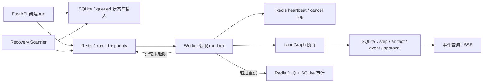

# CareerAgent 生产工程与安全设计

## 1. FastAPI 并发不是“所有函数都加 async”

CareerAgent 把并发用在等待型任务，把事务写入保持顺序：

- 五个岗位源通过 `asyncio.gather` 并行请求；
- 美团详情、阿里批次和批量 JD 处理用 semaphore 限制并发；
- HTTP 与 LLM 使用 `httpx.AsyncClient`；
- 面试 RAG 将 embedding/reranker 这类同步计算放入 `asyncio.to_thread`，避免长时间阻塞事件循环；
- 多组 rerank 使用一次 batch predict，减少模型调用开销；
- 同一个 SQLAlchemy Session 的写入不并发，因为同步 Session 不是线程安全对象，SQLite 也只有一个写者窗口。

因此项目的并发分成两层：API/领域层并行外部 I/O，Redis worker 并行不同 run。单个 run 的写库节点仍按 LangGraph 依赖顺序执行。

## 2. 为什么不用 FastAPI BackgroundTasks

`BackgroundTasks` 跟随 API 进程生命周期：服务重启会丢任务，多进程实例之间没有统一队列，也难以做锁、重试、优先级、DLQ 和 worker 心跳。CareerAgent 的简历定制、完整求职流程和评测可能持续几十秒到十几分钟，因此已经迁移到 Redis 外部队列。

当前不是直接引入 Celery/Arq，而是实现了一个范围明确的 Redis worker：

- high/normal/low 三个队列；
- BRPOP 按优先级消费；
- 多 worker supervisor；
- run lock、heartbeat、cancel flag、rate limit；
- worker 级有限重试、DLQ、人工 replay/discard；
- queued recovery scanner；
- graceful drain 和健康文件。

选择自建轻量队列的原因是项目只需要一种 Agent run 和一种评测 task，当前调度语义有限，代码可直接展示关键可靠性机制。若继续增加 ETA、周期任务、复杂路由和分布式监控，应迁移到 Celery/Arq，而不是继续扩充自建调度器。

## 3. Redis 与 SQLite 的职责

**SQLite 是 source of truth**：业务对象、RAG chunk、Agent run、审批、LLM 日志和评测结果都在 SQLite。

**Redis 是 coordination layer**：队列、锁、限流、心跳、取消和 Pub/Sub 可以丢失或重建。

这种划分解决了“Redis 重启后业务数据是否消失”的问题。Recovery scanner 会扫描 SQLite 中超过阈值仍为 `queued` 的 run，通过 recovery lock 防重复后重新入队。

## 4. 重复消费与业务幂等

消息队列通常只能保证至少一次投递，不能假设一个 run 只被消费一次。CareerAgent 使用三层防重：

1. **Redis run lock**：worker 执行前 `SET NX EX`，避免两个 worker 同时执行同一 run。
2. **SQLite 业务幂等键**：`match_results`、`resume_versions`、`applications`、`interview_preps` 有唯一 idempotency key。键在第一次 INSERT 的同一事务中写入；节点恢复或消息重放时命中唯一键则复用产物并写 `idempotency_reused` 事件。
3. **审批级单次执行**：浏览器和邮件工具以 approval 为边界，一个审批只能对应一次高风险执行。

锁只避免并发，幂等才保证锁过期、进程崩溃或人工重放后不会创建重复业务产物。

## 5. 心跳、Stale、恢复和 DLQ

Worker 心跳不是一个布尔值，而是记录阶段，例如：

- `run_lock_acquired`
- `sqlite_run_loaded`
- `langgraph_started`
- 当前图节点/任务阶段
- `run_completed`

运维可以区分“消息没被消费”“已拿锁但没加载数据库”“图内长节点执行中”。

异常处理分两类：

- **业务失败**：fit gate 拒绝、Guardrail 失败、LLM 返回非法结构等，直接写 run/step 失败和 trace，不无脑重试；
- **worker 级失败**：连接断开、执行器异常等，payload 的 `attempts` 增加并重新入队；达到 `REDIS_WORKER_MAX_ATTEMPTS` 后进入 DLQ。

DLQ 保存 payload、error、worker_id、失败时间和 `dlq_id`。控制台可以人工 replay 或 discard，两种操作都会写 `ops_audit_events`。

Running run 还有独立的 crash scanner。它只在 SQLite 状态超过 stale 阈值，且 Redis heartbeat 与 run lock 都不存在时执行恢复；满足任意活跃信号就跳过，避免把仍在长节点中的任务重复消费。恢复 payload 标记 `checkpoint_resume` 并进入 high priority 队列，默认最多 3 次，超过后才记录 `run_recovery_exhausted` 并失败。迁移前没有 `graph_thread_id` 的旧 run 无法定位 checkpoint，会直接记录 `crash_recovery_unavailable`，不会无意义入队重试。

## 6. LangGraph checkpoint 与业务数据库为什么都需要

Checkpoint 保存“图执行到哪个节点、下一步等待什么”；业务表保存“已经创建了哪些可查询产物、审批和审计”。只有 checkpoint 没有业务表，页面难以查询岗位和简历；只有业务表没有 checkpoint，人工确认后不知道从图的哪个位置继续。

人工确认恢复协议是：

1. 用 `agent_runs.graph_thread_id` 定位 checkpoint；
2. API 校验 run 当前确实处于等待状态；
3. 审批决定先落 `agent_approvals`；
4. 使用 `Command(resume=payload)` 恢复；
5. 下游写库节点再次检查幂等键；
6. 事件流记录 interrupt、resume、节点完成和终态。

进程崩溃恢复协议是：

1. scanner 用 SQLite stale 时间、Redis heartbeat 和 run lock 判断 worker 已失联；
2. run 重新进入 queued，并记录 recovery attempt；
3. Orchestrator 读取原 `graph_thread_id` 的最新 checkpoint；
4. 调用 `graph.ainvoke(None, config)` 从 `snapshot.next` 继续，而不是从输入重新规划；
5. 每个业务写节点使用首次事务唯一幂等键，覆盖“业务已提交、checkpoint 未提交”的崩溃窗口；
6. 恢复、跳过和耗尽都进入 trace、OpsAudit 和 `agent_run_control_actions`。

历史回溯使用分支而非原地改写：复制用户选中的非终态 checkpoint 到新 thread，使用 LangGraph `uuid6()` 生成可排序 checkpoint ID，并创建新的 AgentRun。原 run 的 checkpoint、trace、审批和产物保持不变。

业务撤回也不等于数据库删除。它软撤回本 run 生成的 ResumeVersion、Application 和 InterviewPrep，取消未执行审批并保留审计；若存在已发送邮件或已提交浏览器表单，则拒绝标记为已撤回，因为这些副作用已经无法由本地事务补偿。

## 7. 人工审批和高风险工具网关

前端一个“确认”按钮不等于安全边界。CareerAgent 的审批是独立业务实体：

- `run_id`
- `action_type`
- `payload_hash`
- `payload_summary_json`
- `status=pending/approved/rejected/cancelled`
- requester、decider、decision note 和时间

`HighRiskActionToolService` 在执行前读取审批表，并检查 action type、run、payload 和状态。未 approved 直接拒绝；工具执行成功或失败都写 artifact 和 audit event。

当前高风险动作包括：

| 动作 | 为什么高风险 | 实际边界 |
| --- | --- | --- |
| `application_packet` | 可能包含个人信息和岗位声明 | 生成前 interrupt；仍不自动最终提交 |
| `browser_apply` | 操作第三方招聘表单 | Playwright 只在审批后填写/执行 |
| `email_draft` | 生成可能被外发的个人文案 | 审批后生成 EML/草稿 artifact |
| `email_send` | 对外发送不可逆 | 审批后通过 SMTP 执行并审计 |

## 8. 多租户和权限

项目已有：

- `tenants`、`app_users`；
- PBKDF2-SHA256 密码摘要；
- HMAC 签名、带过期时间的 session cookie；
- `owner/admin/ops` 角色；
- `X-Tenant-Id`、`X-User-Id`、`X-User-Roles` 可信 header 兼容；
- `profiles/jobs/agent_runs` 等核心查询带 tenant filter；
- Admin Token 和 mutation guard；
- 运维动作记录 actor。

这能支持内网或演示环境的租户隔离，但不是完整公网身份平台。当前没有 OIDC/SSO、细粒度资源 ACL、CSRF token 体系和全表 tenant 下沉证明。面试时应描述为“RBAC/session 基础已经实现，正式企业部署会接入 OIDC 并做系统化越权测试”。

## 9. Prompt Injection 防护

### 9.1 威胁模型

PDF、JD、RAG chunk 和面经可能包含：

- 覆盖系统指令；
- 要求自动调用浏览器或邮件；
- 索取系统 Prompt 或用户数据；
- 被检索时触发的 RAG 污染指令。

### 9.2 当前实现

`PromptInjectionGuard` 使用两层本地检测：明确攻击 pattern + 带权重的特征分类器。分类器检测 override、forced output、tool command、data exfiltration、retrieval trigger 和 external endpoint，超过 0.72 判为风险。命中的行在进入 LLM 前删除，原始检测结果写入结构化 metadata。

这里必须准确表述：当前“分类器”是可解释的 pattern-feature scoring，不是训练得到的 Transformer 分类模型。优点是离线、低延迟、行为可审计；缺点是语言变体泛化有限。它只是第一道内容过滤，真正的纵深防御还包括：

- 外部文本始终放在 data 字段，不参与 Tool Policy；
- Planner 只能选择注册工具；
- Skill 再限制 allowed tools；
- 高风险工具必须审批；
- 生成结果还经过事实与副作用 Guardrail。

所以即使 detector 漏掉一条新型注入，文本也不能直接获得浏览器或邮件权限。

### 9.3 当前评测边界

70 个固定 case 上，40 个攻击和 30 个良性样本的 detection recall、true negative rate、severity accuracy 都为 100%，四类来源和四类攻击均过门禁。这个结果证明回归集，没有证明面对任意攻击仍是 100%。上线后仍需要加入真实失败样本、编码混淆、多轮间接注入和人工红队。

## 10. LLM 可靠性、预算和日志

统一 `LLMClient` 提供：

- OpenAI-compatible API；
- 节点级 Flash/Pro 路由；
- 网络断连、429、5xx 的有限重试；
- strict JSON 和空 `content` 检查；
- 工作流级 `max_calls/max_prompt_chars/max_completion_tokens` 预留；
- token、缓存 token、模型、route、耗时、状态和错误日志；
- `evaluation_run_id/case/stage/run_id` trace context。

业务 JSON 错误不走无限网络重试。需要修复时由具体服务执行一次有名字的 repair，例如 `jd_parser.parse_jd.repair_json` 或 `resume_tailor.repair_resume`，便于区分供应商抖动和业务输出错误。

DeepSeek V4 官方接口在 `LLM_THINKING_MODE=auto` 时发送 `thinking: disabled`。原因是结构化 JSON 链路曾出现只有 `reasoning_content`、最终 `content` 为空；这里关闭思考不是宣称思考无用，而是优先保证当前兼容接口的输出合同。需要思考模式的研究任务应单独评测，不应在所有 JSON 节点全局开启。

## 11. 可观测性

一次 run 同时保留：

- `agent_runs`：业务输入、状态、图 thread 和终态；
- `agent_steps`：每个工具/节点输入、输出、耗时和错误；
- `agent_artifacts`：计划、岗位结果、简历、投递、面试和业务摘要；
- `agent_events`：LangGraph node start/update/end、interrupt、resume、step 和 artifact 事件；
- `agent_approvals`：高风险决策；
- `llm_call_logs`：模型调用；
- `ops_audit_events`：运维处置。

前端用 SSE 展示事件流，页面刷新后从 run ID 和数据库历史恢复，不依赖浏览器内存。业务摘要分为路由、过程、结果和副作用四层，使用户不需要阅读原始 JSON；控制台仍能展开原始 trace 排障。

## 12. 部署和健康检查

- `/health`：进程存活；
- `/ops/readiness`：数据库、LLM、embedding、reranker 等依赖；
- `/ops/metrics`：HTTP、run、task、LLM 和评测统计；
- `/ops/llm-usage`：按模型、route、workflow 和 trace 汇总真实 token 与成本；
- worker supervisor：结构化日志、子进程拉起、健康文件、drain 文件和优雅退出；
- Redis 支持 standalone 和 Sentinel master discovery；
- 本地 SMTP smoke 使用 Mailpit 容器；浏览器 smoke 使用 Playwright。

## 13. 容量边界与下一步

当前设计适合单机或小团队部署，不适合直接声称大规模生产：

- SQLite WAL 提高读写并发，但高写入吞吐和多节点共享应迁移 PostgreSQL；
- Chroma 是可重建镜像，大规模岗位库可迁移 pgvector/Qdrant/Milvus；
- Redis Sentinel 支持 HA，但尚未提供完整 Kubernetes 编排、自动扩缩容和云监控；
- 自建 worker 已有可靠性骨架，复杂调度应迁移 Celery/Arq；
- Session/RBAC 需要 OIDC、CSRF 和完整资源授权测试；
- 外部招聘站适配器需要契约监控和定期 smoke，不能把一次可达性当长期 SLA。

面试中可以把这些说成明确的演进条件：只有当负载或组织需求跨过当前边界时再迁移，不为了堆技术提前引入分布式复杂度。
