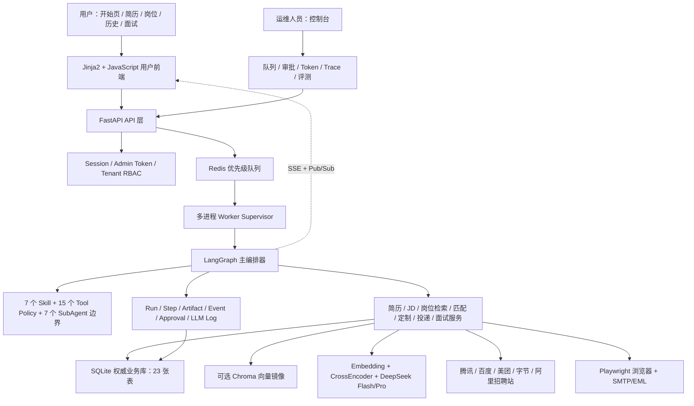

# CareerAgent 项目总览与架构

## 1. 项目定位

CareerAgent 是面向中文 Agent/LLM 应用开发岗位的求职助手。它处理的不是一次问答，而是一条有状态、有副作用、有质量风险的业务流程：用户可以只搜索岗位，也可以上传或创建简历后匹配岗位；选中具体 JD 后，系统检索简历中的真实经历，分析匹配与差距，生成证据约束的定制简历，经过人工审批后准备或执行投递动作，最后围绕 JD、项目与面经资料生成可练习的面试包。

项目最重要的工程目标有四个：

1. **结果有证据**：岗位建议、简历改写和面试回答必须能回指 JD、简历 chunk 或项目文档，不能只靠模型常识。
2. **长流程可恢复**：页面刷新、API 进程重启或 worker 异常后，任务状态、图 checkpoint 和业务产物不能丢失。
3. **高风险动作受控**：浏览器填写、邮件草稿、邮件发送和投递包都必须经过审批、幂等和审计边界。
4. **质量可量化**：不仅检查 HTTP 200，还评估检索召回、排序、事实一致性、工具轨迹、业务终态、稳定性、延迟和 Token 成本。

## 2. 用户视角的三种入口

CareerAgent 没有把“必须先有简历”写死，岗位发现支持三种实际使用方式：

| 输入方式 | 系统行为 | 用户看到的结果 |
| --- | --- | --- |
| 只填写求职需求 | 根据岗位、城市、实习/校招偏好检索真实来源和系统岗位库 | 岗位列表与完整 JD，不展示伪造的个人匹配分 |
| 只选择或上传简历 | 从目标岗位、技能和经历构造检索 query | 岗位列表、匹配分、已匹配技能与缺口 |
| 同时填写需求和简历 | 显式需求优先，简历补充技能和经历信号 | 更精确的岗位排序；进入详情后可做差距分析和定制 |

首页只负责把用户带到“找到并选择岗位”。系统不会静默选择 Top1 后自动投递。用户在岗位详情页确认目标 JD，再决定是否生成定制简历、投递材料或面试准备包。

## 3. 总体架构

### 3.1 分层职责

- **前端层**：面向用户展示岗位、简历、定制版本、投递和面试练习；运维数据只进入控制台。
- **API 层**：Pydantic 校验、权限上下文、资源查询、SSE、后台入队，不在路由函数里堆业务逻辑。
- **Agent 层**：LangGraph 状态图、计划、interrupt/resume、Skill/Tool 授权和运行终态。
- **领域服务层**：PDF/JD 解析、RAG、匹配、Guardrail、外发、评测等可独立测试的能力。
- **持久化层**：SQLite 保存权威业务状态；Redis 只做协调；Chroma 只做可重建向量镜像。
- **外部能力层**：招聘站、DeepSeek、Embedding/Reranker、浏览器和邮件。

这种分层避免了“所有逻辑都在 Agent Prompt 中”的问题。LLM 负责语义理解和生成，状态转移、权限、幂等、审批和事实发布由代码控制。

## 4. LangGraph 控制面

主图位于 `app/agents/langgraph_orchestrator.py`，当前注册 17 个节点，包括计划、加载档案、搜索岗位、匹配、岗位选择、加载 JD、定制简历、fit gate、投递包、面试包和不同任务的 finalize 节点。五类任务共用一张图：

- `find_jobs_for_profile`
- `tailor_resume_for_job`
- `quick_apply`
- `prepare_interview_for_job`
- `full_career_flow`

完整流程的数据流如下：

```mermaid
flowchart LR
    A["plan_task"] --> B["load_profile"]
    B --> C["search_jobs"]
    C --> D["match_jobs"]
    D --> E{"是否已有 job_id"}
    E -- 否 --> F["interrupt：用户选择岗位"]
    F --> G["load_job"]
    E -- 是 --> G
    G --> H["match_job"]
    H --> I["tailor_resume"]
    I --> J["fit_gate"]
    J --> K["ensure_resume_version"]
    K --> L{"投递材料审批"}
    L -- 待确认 --> M["interrupt + agent_approvals"]
    M -- approved --> N["create_application_packet"]
    N --> O["generate_interview_prep"]
    O --> P["business_summary + finalize"]
```

Graph state 只保存 JSON 友好的 ID 和摘要，例如 `profile_id`、`job_id`、`resume_version_id`、`match_result_id`、`selected_job` 和 `fit_gate`。SQLAlchemy Session 不放进 state，避免 checkpoint 无法序列化和跨进程恢复后拿到失效连接。

LangGraph checkpointer 使用独立 SQLite 文件 `data/runtime/langgraph_checkpoints.sqlite`。恢复时 API 使用同一个 `graph_thread_id` 和 `Command(resume=...)` 继续图执行，而不是从头重放整个求职流程。

## 5. Agent 能力模型

### 5.1 Skill

项目有 7 个版本化 `SKILL.md`：简历建档、JD 结构化、证据检索、适配判断、简历定制、投递包和面试准备。Skill 声明触发条件、输入、允许工具、输出契约、禁止行为和失败策略。

Skill 使用渐进式披露：列表接口只返回 metadata；Planner 只把当前任务需要的精简契约放入计划；只有调试或执行需要时才读取完整指令。这样做是为了降低上下文噪声，不是为了把 Markdown 文件包装成另一个模型。

### 5.2 Tool Policy

项目注册 15 个工具。每个工具不仅有名字，还声明风险等级、审批类型、幂等策略、超时、重试、审计事件和允许它的 Skill。Planner 会校验计划中的所有工具都被当前 Skill 授权。

典型工具包括 `job_search.search_jobs`、`jd_parser.parse_jd`、`matcher.match_job`、`resume_tailor.tailor_resume`、`guardrail.verify_resume`、`application.create_quick_apply_packet`、`browser_apply` 和 `email_send`。

### 5.3 SubAgent

7 个 SubAgent 是责任边界，而不是 7 个常驻 LLM 进程：`profile_analyst`、`job_analyst`、`evidence_curator`、`fit_judge`、`resume_writer`、`application_operator`、`interview_coach`。

上下文压缩没有设计成 `context_manager` SubAgent，因为压缩是每次模型调用前的 runtime policy，不是需要自主规划的业务角色。这样更容易测试预算、追踪丢失证据，也不会增加一次无意义的模型调用。

## 6. 数据架构

当前 SQLAlchemy metadata 有 23 张表，可以按职责理解：

| 分组 | 表 | 作用 |
| --- | --- | --- |
| 身份与租户 | `tenants`、`app_users` | 多租户、用户、角色和密码摘要 |
| 简历知识 | `profiles`、`resume_chunks`、`resume_versions` | 原档案、结构化字段、PDF/字段 chunk、定制版本 |
| 岗位知识 | `jobs`、`job_chunks`、`job_search_sessions`、`job_search_results` | JD、结构化字段、向量、搜索输入与排序快照 |
| 求职产物 | `match_results`、`applications` | 匹配维度、证据、缺口、投递材料与状态 |
| 面试 | `interview_preps`、`interview_practice_items`、`interview_experiences` | 面试包、逐题练习和用户导入面经 |
| Agent 运行 | `agent_runs`、`agent_steps`、`agent_artifacts`、`agent_events`、`agent_approvals` | 运行状态、工具步骤、产物、LangGraph 事件和审批 |
| 运维与评测 | `llm_call_logs`、`ops_audit_events`、`evaluation_runs`、`task_runs` | 模型用量、审计、评测结果和后台任务 |

SQLite 使用 WAL、30 秒 busy timeout 和外键约束。它是 source of truth；Redis 队列消息丢失可以从 SQLite 恢复，Chroma 索引损坏也可以从 chunk 和 embedding 重建。

## 7. 模型和检索架构

项目采用节点级模型路由，而不是一刀切：

- **Flash**：自然语言规划、简历解析、JD 解析、fit 评测、简历定制和投递文案。这些节点结构化强、上下文相对短，实测 Flash 更快且质量可接受。
- **Pro**：简历深度评审、面试问题、面试 Agentic RAG 生成与 claim verifier。这些节点需要长上下文、多约束回答和严格证据判断。
- **configured_default**：trace 没命中已注册前缀时使用 `LLM_MODEL`。它是可观测的遗漏桶，不是失败 fallback；上线前应持续把有稳定业务语义的调用归入显式路由。

所有调用经过统一 `LLMClient`，记录 trace、路由、模型、输入输出 token、缓存 token、耗时、错误和有限预览。工作流还可以设置最大调用次数、Prompt 字符和 completion token 预留，超预算在发请求前直接失败。

## 8. 为什么它不是 Toy Demo

一个 Toy 通常只展示“上传文件后模型返回一段文本”。CareerAgent 的差异在于：

- 有真实的多入口业务流程和用户选择，而不是固定脚本；
- 简历和 JD 都进入可持久化、可引用的知识库；
- LangGraph interrupt、checkpoint 和 Redis worker 处理长任务与人工审批；
- 浏览器和邮件属于真实高风险工具，有独立审批和审计；
- LLM 的 raw 草稿与最终发布结果分离，错误内容可以留在 trace 而不进入用户产物；
- 评测覆盖组件、检索、轨迹、业务终态、安全、可靠性和成本，并允许发布门禁失败。

但项目也不应被描述成成熟 SaaS。当前权威库仍是 SQLite，OIDC/SSO、跨节点数据库、线上真实用户校准和完整全量发布复测仍未完成。承认这些边界，反而能体现工程判断。

## 9. 代码地图

| 想讲的能力 | 主要代码 |
| --- | --- |
| LangGraph 主流程 | `app/agents/langgraph_orchestrator.py` |
| 自然语言计划与修复 | `app/agents/natural_language.py` |
| Skill/Tool/SubAgent | `app/agents/skills.py`、`tools.py`、`subagents.py`、`skills/*/SKILL.md` |
| PDF 和简历解析 | `app/services/resume_parser.py`、`text_splitter.py` |
| JD 与岗位源 | `app/services/jd_parser.py`、`job_sources.py`、`job_search.py` |
| 岗位发现与排序 | `app/services/job_discovery.py`、`job_relevance.py` |
| RAG 和重排 | `app/services/vector_index.py`、`embedding_service.py`、`reranker.py` |
| 匹配、定制和门禁 | `matcher.py`、`resume_tailor.py`、`guardrails.py` |
| 面试 Agentic RAG | `interview_prep.py`、`interview_agentic_rag.py` |
| 队列和恢复 | `task_runner.py`、`scripts/run_agent_worker*.py` |
| 审批与外发 | `approval_service.py`、`high_risk_action_tools.py`、`outbound_tools.py` |
| 评测 | `evaluation.py`、`agent_system_evaluation.py`、`evals/*.json` |
