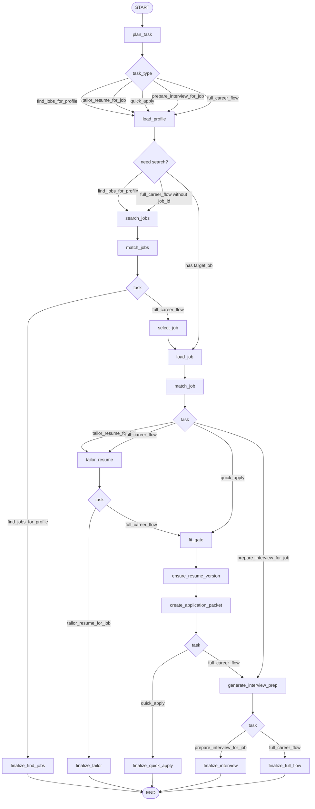
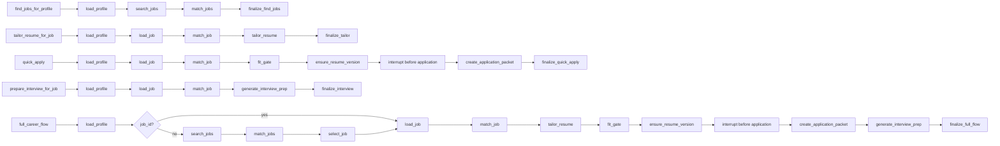
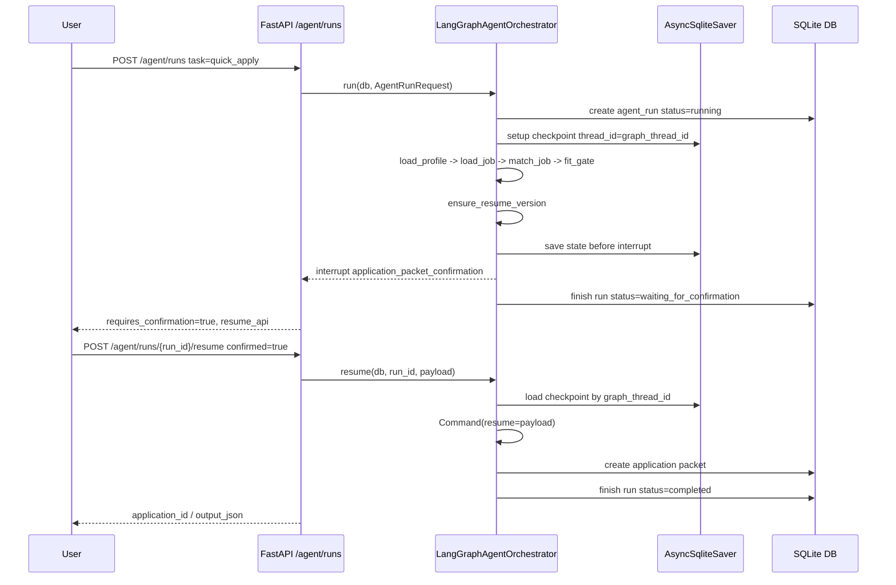
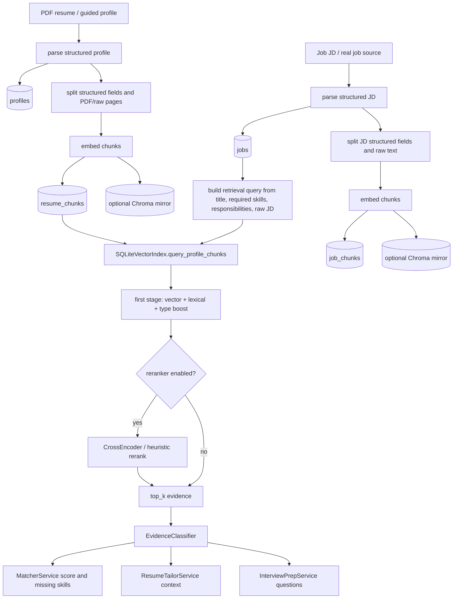
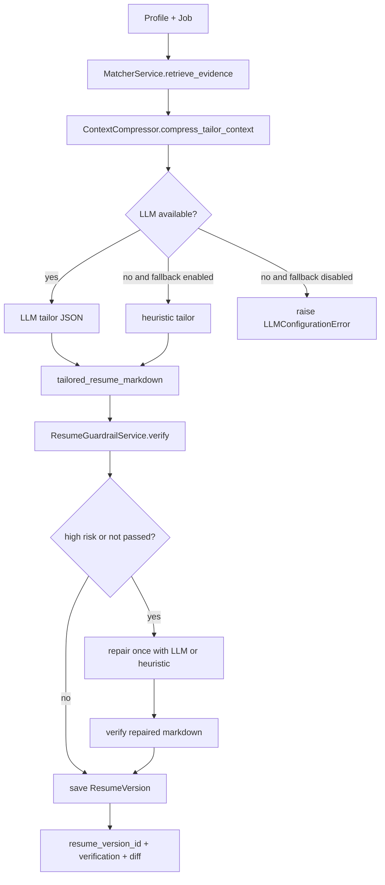
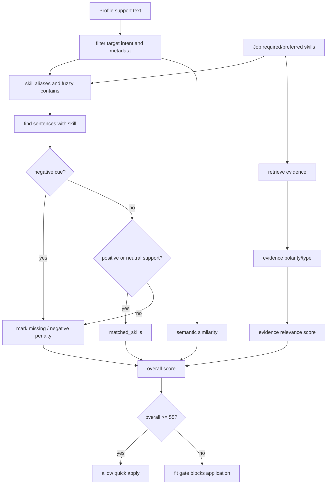
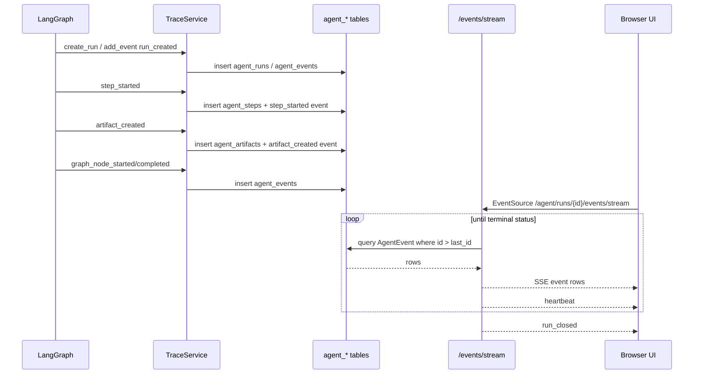
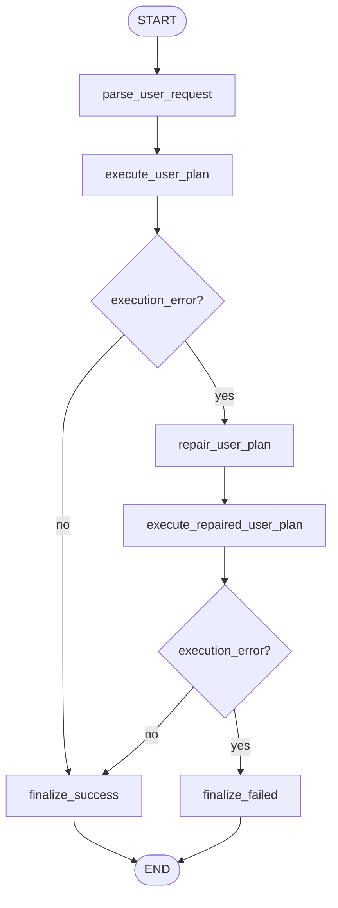
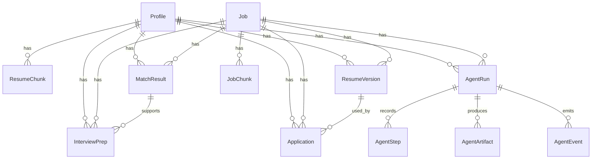
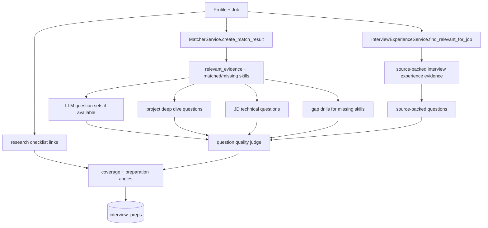

# CareerAgent Workflow Diagrams

> 图示基于真实代码：`app/agents/langgraph_orchestrator.py`、`app/agents/natural_language.py`、`app/api/agent_runs.py`、`app/services/*`。

## 1. LangGraph 主工作流

代码位置：`app/agents/langgraph_orchestrator.py::_build_graph`



## 2. Five Task Paths



## 3. Checkpoint / Interrupt / Resume

代码位置：

- `app/agents/langgraph_orchestrator.py::_application_confirmation`
- `app/agents/langgraph_orchestrator.py::resume`
- `app/api/agent_runs.py::resume_agent_run`
- `app/core/config.py::Settings.langgraph_checkpoint_file`



关键边界：

- interrupt 前不写 `applications`。
- 拒绝确认会让 run failed。
- 非 `waiting_for_confirmation` 状态调用 resume 返回 409。

## 4. RAG / Evidence Flow

代码位置：

- `app/services/resume_parser.py::ResumeParserService`
- `app/services/text_splitter.py::ResumeTextSplitter`
- `app/services/vector_index.py::SQLiteVectorIndex`
- `app/services/matcher.py::MatcherService`
- `app/services/evidence_classifier.py::EvidenceClassifier`
- `app/services/resume_tailor.py::ResumeTailorService`



## 5. Resume Tailor + Guardrail Repair

代码位置：`app/services/resume_tailor.py::ResumeTailorService.tailor_resume`



Guardrail 会检查：

- unsupported metrics
- possible new claims
- unsupported required skill claims
- missing skill in resume body

## 6. Matcher / Negative Evidence

代码位置：`app/services/matcher.py::MatcherService.build_match_payload`



## 7. Trace / Event / SSE

代码位置：

- `app/services/trace_service.py`
- `app/agents/langgraph_orchestrator.py::_record_langgraph_event`
- `app/api/agent_runs.py::_agent_event_sse`
- `app/static/js/main.js::subscribeAgentRunEvents`



Fallback：

```mermaid
flowchart LR
    A[waitForAgentRun] --> B{EventSource available?}
    B -->|yes| C[subscribeAgentRunEvents]
    B -->|no| D[skip SSE]
    A --> E[setInterval poll /agent/runs/{id}]
    C --> F[update stage from node events]
    E --> G{completed / failed / waiting?}
    G -->|yes| H[finish or resume]
```

## 8. Natural Language Agent

代码位置：`app/agents/natural_language.py::NaturalLanguageAgentService._build_graph`



说明：

- repair 只有一次，不会无限循环。
- repair prompt 明确不得绕过事实校验、投递门禁或人工确认边界。
- 执行计划最终调用主 `AgentOrchestrator`，所以高风险动作仍走主图 guardrail/interrupt。

## 9. Data Model Overview



模型代码位置：`app/models/entities.py`

## 10. Interview Prep Flow

代码位置：`app/services/interview_prep.py::InterviewPrepService`



边界：

- 已导入面经正文可作为 source-backed evidence。
- 未导入正文时只生成搜索参考链接，不编造真实面经内容。
- missing skills 进入 gap drill，不包装成已掌握经验。
